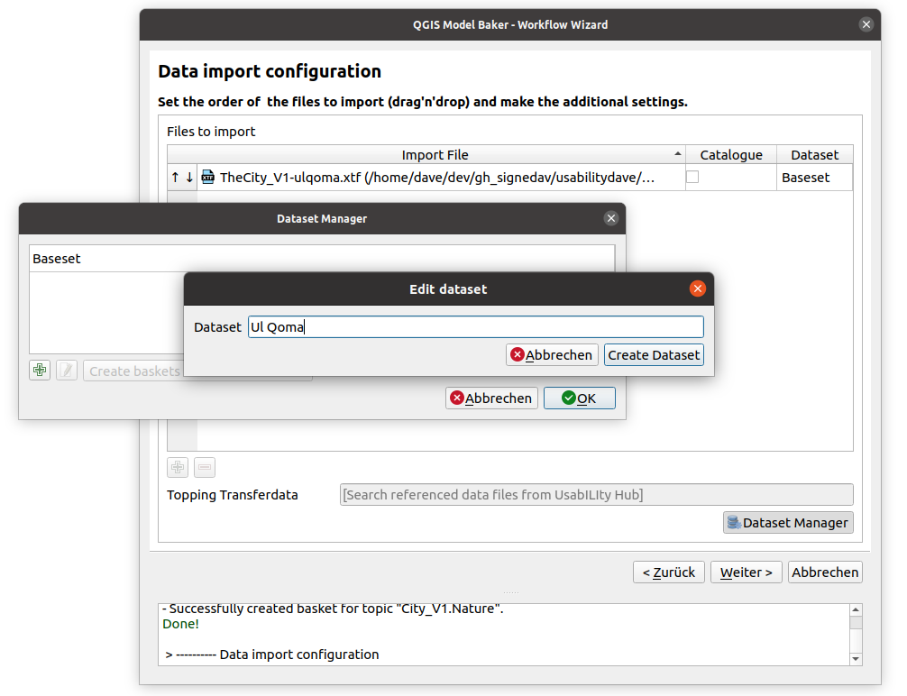
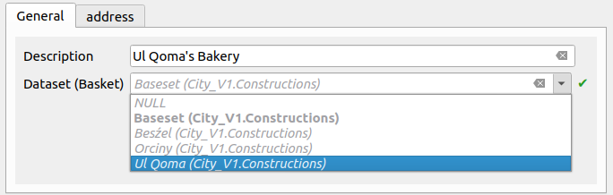
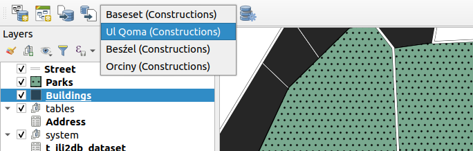
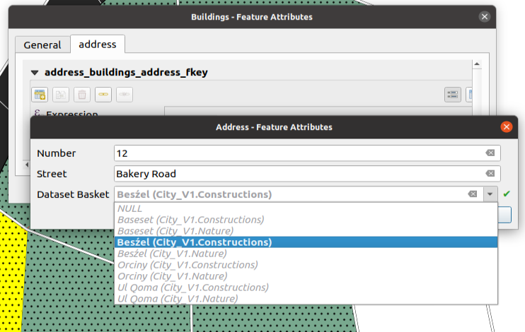

## What are Datasets and Baskets

A dataset contains data of a certain spatial or thematic area, which does not affect the model structure. The data of a dataset can thus be managed, validated and exported independently of the other data. Baskets are a smaller instance. While the datasets usually comprise the whole model (or even several), the baskets are usually a part of a topic. Often they are even the subset of topic and dataset.

Datasets and baskets allow you to seperate your data thematically without affecting the INTERLIS model. They do only concern the data. You can import, export and validate them seperately by the provided filter methods of ili2db and Model Baker.

## Import Data of a Dataset

### Example Use Case
Let's say we have two melted twin cities "Beźel" and "Ul Qoma". We want to import into the same physical data model but handle them always seperately.

### INTERLIS Model

Here we have a simple model representing a city with constructions (buildings and streets) and nature (parks).

```
INTERLIS 2.3;

MODEL City_V1 (en)
AT "https://signedav.github.io/usabilitydave/models"
VERSION "2020-06-22" =
  IMPORTS GeometryCHLV95_V1;

  DOMAIN
    Line = POLYLINE WITH (STRAIGHTS) VERTEX GeometryCHLV95_V1.Coord2;
    Surface = SURFACE WITH (STRAIGHTS) VERTEX GeometryCHLV95_V1.Coord2 WITHOUT OVERLAPS > 0.005;

  STRUCTURE Address =
    Street: TEXT;
    Number: TEXT;
  END Address;

  TOPIC Constructions =
    OID AS INTERLIS.UUIDOID;
    BASKET OID AS INTERLIS.UUIDOID;

    CLASS Buildings  =
      Code : MANDATORY TEXT*15;
      Description : MANDATORY TEXT*99;
      Address : Address;
      Geometry: Surface;
    END Buildings;

    CLASS Street  =
      Code : MANDATORY TEXT*15;
      Description : MANDATORY TEXT*99;
      Address : Address;
      Geometry: Line;
    END Street;

  END Constructions;

  TOPIC Nature =
    OID AS INTERLIS.UUIDOID;
    BASKET OID AS INTERLIS.UUIDOID;

    CLASS Parks  =
      Name : MANDATORY TEXT*99;
      Address : Address;
      Geometry: Surface;
    END Parks;

  END Nature;

END City_V1.
```

The model defines `BASKET OID` this means it requires stable basket ids and here in the format of an UUID. Same for the `OID`, where it requires stable UUIDs for every object (`t_ili_tid`). This column is created per default in Model Baker even when the Model does not require it.


!!! Note
    We need to create the physical model the ili2db parameter `--createBasketCol`. This we can activate by setting with *Create Basket Column* in the [Model Baker Wizard](../../user_guide/import_workflow/#ili2db-settings). Ili2db creates a new column `t_basket` in class tables which references entries in the additional table `t_ili2db_baskets`. The `t_basket` column needs to be filled with the basket to which an object belongs. But no worry, it's supereasy with [dataset selector](#dataset-selector).

### Data of Ul Qoma

And here are the data from one of the cities (Ul Qoma):
```
<?xml version="1.0" encoding="UTF-8"?><TRANSFER xmlns="http://www.interlis.ch/INTERLIS2.3">
<HEADERSECTION SENDER="ili2pg-4.6.1-63db90def1260a503f0f2d4cb846686cd4851184" VERSION="2.3"><MODELS><MODEL NAME="City_V1" VERSION="2020-06-22" URI="https://signedav.github.io/usabilitydave/models"></MODEL></MODELS></HEADERSECTION>
<DATASECTION>
<City_V1.Constructions BID="7dc3c035-b281-412f-9ba3-c69481054974">
  <City_V1.Constructions.Buildings TID="c7c3e013-b5bb-474d-b7d8-1f8de718e160"><Address><City_V1.Address><Street>Rue des Fleures</Street><Number>1</Number></City_V1.Address></Address><Description>Maison Une</Description><Geometry><SURFACE><BOUNDARY><POLYLINE><COORD><C1>2698886.335</C1><C2>1262452.203</C2></COORD><COORD><C1>2698895.284</C1><C2>1262445.346</C2></COORD><COORD><C1>2698902.726</C1><C2>1262460.945</C2></COORD><COORD><C1>2698895.825</C1><C2>1262467.883</C2></COORD><COORD><C1>2698886.335</C1><C2>1262452.203</C2></COORD></POLYLINE></BOUNDARY></SURFACE></Geometry></City_V1.Constructions.Buildings>
  <City_V1.Constructions.Buildings TID="3d6ceabe-7674-4436-8316-ef3b72ba1327"><Address><City_V1.Address><Street>Rue des Fleures</Street><Number>2</Number></City_V1.Address></Address><Description>Maison2</Description><Geometry><SURFACE><BOUNDARY><POLYLINE><COORD><C1>2698895.825</C1><C2>1262467.883</C2></COORD><COORD><C1>2698902.726</C1><C2>1262460.945</C2></COORD><COORD><C1>2698911.469</C1><C2>1262479.960</C2></COORD><COORD><C1>2698906.189</C1><C2>1262485.007</C2></COORD><COORD><C1>2698895.825</C1><C2>1262467.883</C2></COORD></POLYLINE></BOUNDARY></SURFACE></Geometry></City_V1.Constructions.Buildings>
  <City_V1.Constructions.Buildings TID="d93069ea-ca81-4891-8055-e5791d1be167"><Description>Maison trois</Description><Geometry><SURFACE><BOUNDARY><POLYLINE><COORD><C1>2698916.495</C1><C2>1262502.034</C2></COORD><COORD><C1>2698923.489</C1><C2>1262491.762</C2></COORD><COORD><C1>2698928.297</C1><C2>1262492.854</C2></COORD><COORD><C1>2698926.858</C1><C2>1262505.315</C2></COORD><COORD><C1>2698916.495</C1><C2>1262502.034</C2></COORD></POLYLINE></BOUNDARY></SURFACE></Geometry></City_V1.Constructions.Buildings>
  <City_V1.Constructions.Buildings TID="100415e2-db32-49aa-8d44-9eff1f38e372"><Address><City_V1.Address><Street>Parque de la Musique</Street><Number>1</Number></City_V1.Address></Address><Description>Maison Quatre</Description><Geometry><SURFACE><BOUNDARY><POLYLINE><COORD><C1>2698934.417</C1><C2>1262440.620</C2></COORD><COORD><C1>2698934.854</C1><C2>1262426.195</C2></COORD><COORD><C1>2698949.060</C1><C2>1262428.600</C2></COORD><COORD><C1>2698947.958</C1><C2>1262441.422</C2></COORD><COORD><C1>2698934.417</C1><C2>1262440.620</C2></COORD></POLYLINE></BOUNDARY></SURFACE></Geometry></City_V1.Constructions.Buildings>
  <City_V1.Constructions.Street TID="451cfaee-299f-4b72-bcc2-6b6a097ee0d2"><Name>Rue des Fleures</Name><Geometry><POLYLINE><COORD><C1>2698866.447</C1><C2>1262410.241</C2></COORD><COORD><C1>2698886.335</C1><C2>1262452.203</C2></COORD><COORD><C1>2698916.495</C1><C2>1262502.034</C2></COORD><COORD><C1>2698929.609</C1><C2>1262506.186</C2></COORD></POLYLINE></Geometry></City_V1.Constructions.Street>
  <City_V1.Constructions.Street TID="d6ed2502-7161-4e04-8589-3cd6c84a51e0"><Name>Rue de la Musique</Name><Geometry><POLYLINE><COORD><C1>2698929.609</C1><C2>1262506.186</C2></COORD><COORD><C1>2698943.596</C1><C2>1262509.027</C2></COORD><COORD><C1>2698940.099</C1><C2>1262488.920</C2></COORD><COORD><C1>2698959.332</C1><C2>1262489.795</C2></COORD><COORD><C1>2698980.969</C1><C2>1262480.834</C2></COORD><COORD><C1>2698993.863</C1><C2>1262415.486</C2></COORD></POLYLINE></Geometry></City_V1.Constructions.Street>
  <City_V1.Constructions.Street TID="1f47c793-326a-47ba-b076-8ae9f25b2990"><Name>Rue de la Soleil</Name><Geometry><POLYLINE><COORD><C1>2698866.447</C1><C2>1262410.241</C2></COORD><COORD><C1>2698901.415</C1><C2>1262410.460</C2></COORD><COORD><C1>2698902.071</C1><C2>1262390.790</C2></COORD><COORD><C1>2698906.005</C1><C2>1262389.041</C2></COORD><COORD><C1>2698935.510</C1><C2>1262391.227</C2></COORD><COORD><C1>2698984.684</C1><C2>1262406.307</C2></COORD><COORD><C1>2698993.863</C1><C2>1262415.486</C2></COORD></POLYLINE></Geometry></City_V1.Constructions.Street>
</City_V1.Constructions>
<City_V1.Nature BID="6cc059e9-0182-4c9f-9208-28be3c172471">
  <City_V1.Nature.Parks TID="3445b04b-a4ed-4a03-bb09-c9e52134cad6"><Name>Parque de la Musique</Name><Geometry><SURFACE><BOUNDARY><POLYLINE><COORD><C1>2698940.099</C1><C2>1262488.920</C2></COORD><COORD><C1>2698932.231</C1><C2>1262487.828</C2></COORD><COORD><C1>2698934.417</C1><C2>1262440.620</C2></COORD><COORD><C1>2698963.922</C1><C2>1262442.368</C2></COORD><COORD><C1>2698963.484</C1><C2>1262465.754</C2></COORD><COORD><C1>2698982.968</C1><C2>1262470.701</C2></COORD><COORD><C1>2698980.969</C1><C2>1262480.834</C2></COORD><COORD><C1>2698959.332</C1><C2>1262489.795</C2></COORD><COORD><C1>2698940.099</C1><C2>1262488.920</C2></COORD></POLYLINE></BOUNDARY></SURFACE></Geometry></City_V1.Nature.Parks>
  <City_V1.Nature.Parks TID="d7e73464-f27e-4d2d-848c-66735f3fe5af"><Name>Parque des Fleures</Name><Geometry><SURFACE><BOUNDARY><POLYLINE><COORD><C1>2698866.447</C1><C2>1262410.241</C2></COORD><COORD><C1>2698901.415</C1><C2>1262410.460</C2></COORD><COORD><C1>2698903.164</C1><C2>1262439.309</C2></COORD><COORD><C1>2698886.335</C1><C2>1262452.203</C2></COORD><COORD><C1>2698866.447</C1><C2>1262410.241</C2></COORD></POLYLINE></BOUNDARY></SURFACE></Geometry></City_V1.Nature.Parks>
</City_V1.Nature>
</DATASECTION>
</TRANSFER>
```

These are basicly the data in a dataset. You might already notice the `BID` fields. These identify the baskets for each topic. It would be technically possible to have multiple baskets per topic in the same dataset but it's usually not used.

### Data Update instead of Import

We need to import the data of Ul Qoma now into our physical model with the ili2db parameter `--dataset "Ul Qoma"`. When the dataset already exists in the physical database we do not make an `--import`, but an `--update` instead. This means all the data in this dataset are updated with the data from the `xtf` file (and removed if not existent there).

With the Model Baker we do make generally an `--update`, because we import only into exiting datasets.

### Dataset Manager

To have a dataset called "Ul Qoma" selectable, we need to create it in the Dataset Manager.



#### Creation of Baskets
With the `--update` of the data to a dataset, the needed baskets are created by `ili2db`. In case you create a new dataset and you want to collect fresh data in QGIS (no import of existing data), the baskets have to be created as well by *Create baskets for selected dataset*.


!!! Note
    When baskets are created by the Model Baker, the IDs are UUIDs. To change the IDs, edit the t_ili2db_basket table manually.

### Update command
After that you can double-click the dataset field and choose "Ul Qoma". This command will be excecuted in the background:
```
java -jar /home/freddy/ili2pg-4.6.1.jar --update --dbhost localhost --dbport 5432 --dbusr postgres --dbpwd ****** --dbdatabase freds_bakery --dbschema thecityandthecity --importTid --importBid --dataset "Ul Qoma" /home/freddy/referencedata/TheCity_V1-ulqoma.xtf
```

As you can see `--importTid` and `--importBid` are automatically added to the command. The `--update` command requires stable TIDs and BIDs. In our use case the model defines stable TIDs and BIDs so they won't be required. But in case your model has not defined them, we need to tell ili2db to "assume" that the IDs we import are stable. Because otherwise a proper dataset / basket handling won't be possible.

## Structure in the Database

An end user does not need to know that. But it might be interessting to know how it looks like in the database.
### Dataset and Data of "Ul Qoma"

After importing your data of the city "Ul Qoma", there are now these two tables in the database. They look like this:

*t_ili2db_dataset:*
```
 t_id | datasetname
------+-------------
    4 | Ul Qoma
```

*t_ili2db_basket:*
```
 t_id | dataset |         topic         |              t_ili_tid               |      attachmentkey      | domains
------+---------+-----------------------+--------------------------------------+-------------------------+---------
    5 |       4 | City_V1.Constructions | d861b84f-7068-43d0-b8c1-f0d2f200b075 | TheCity_V1-ulqoma.xtf-5 |
   23 |       4 | City_V1.Nature        | 8d4b122c-3582-447c-b933-3175674151e0 | TheCity_V1-ulqoma.xtf-5 |
```

As you can see the two baskets have been created and connected to the dataset you created before. In fact they do not exactly look like this on your system. There will be the default dataset called `Baseset` created by Model Baker on the creation of the physical database and the corresponding baskets per topic.

When we check out the data now, we see that they are referencing the baskets (which further references the dataset).

*street:*
```
 t_id | t_basket |              t_ili_tid               |       aname       |      ageometry
------+----------+--------------------------------------+-------------------+--------------------
   19 |        5 | 7bcc0efd-1d81-400a-8dfb-1f17f4e72287 | Main Route        | 01020000200808[...]
   20 |        5 | 3eab5bd9-3dc8-4e73-81f1-b8d8cfaba748 | Tiny Route        | 01020000200804[...]
   21 |        5 | b5c3d22c-974f-49c9-b361-d85dbdc4000b | Park Way          | 01020000200808[...]
   22 |        5 | d954d3c4-ec24-44cd-af2d-d7f3af781a18 | Mullholland Drive | 01020000200808[...]
```

*parks:*
```
 t_id | t_basket |              t_ili_tid               |   aname     |      ageometry
------+----------+--------------------------------------+-------------+--------------------------
   24 |       23 | dbe968d7-e41d-4c14-9560-c2161bea76db | UlQoma Park | 01030000200808000800[...]
   25 |       23 | 574eed9f-4cef-4747-8cbb-5e8519898626 | Big Green   | 01030000200808000000[...]
   26 |       23 | d92d5cde-7ef3-48e8-b6cc-e370a5cba64d | Selmas Park | 01030000200080033330[...]
```

### Datasets and Data of "Ul Qoma" and "Besźel"

It looks more interesting when we import the data of "Besźel" as well.

```
<?xml version="1.0" encoding="UTF-8"?><TRANSFER xmlns="http://www.interlis.ch/INTERLIS2.3">
<HEADERSECTION SENDER="ili2pg-4.6.1-63db90def1260a503f0f2d4cb846686cd4851184" VERSION="2.3"><MODELS><MODEL NAME="City_V1" VERSION="2020-06-22" URI="https://signedav.github.io/usabilitydave/models"></MODEL></MODELS></HEADERSECTION>
<DATASECTION>
<City_V1.Constructions BID="7dc3c035-b281-412f-9ba3-c69481054974">
<City_V1.Constructions.Buildings TID="c7c3e013-b5bb-474d-b7d8-1f8de718e160"><Address><City_V1.Address><Street>Rue des Fleurs</Street><Number>1</Number></City_V1.Address></Address><Description>Maison Une</Description><Geometry><SURFACE><BOUNDARY><POLYLINE><COORD><C1>2698886.335</C1><C2>1262452.203</C2></COORD><COORD><C1>2698895.284</C1><C2>1262445.346</C2></COORD><COORD><C1>2698902.726</C1><C2>1262460.945</C2></COORD><COORD><C1>2698895.825</C1><C2>1262467.883</C2></COORD><COORD><C1>2698886.335</C1><C2>1262452.203</C2></COORD></POLYLINE></BOUNDARY></SURFACE></Geometry></City_V1.Constructions.Buildings>
<City_V1.Constructions.Buildings TID="3d6ceabe-7674-4436-8316-ef3b72ba1327"><Address><City_V1.Address><Street>Rue des Fleurs</Street><Number>2</Number></City_V1.Address></Address><Description>Maison 2</Description><Geometry><SURFACE><BOUNDARY><POLYLINE><COORD><C1>2698895.825</C1><C2>1262467.883</C2></COORD><COORD><C1>2698902.726</C1><C2>1262460.945</C2></COORD><COORD><C1>2698911.469</C1><C2>1262479.960</C2></COORD><COORD><C1>2698906.189</C1><C2>1262485.007</C2></COORD><COORD><C1>2698895.825</C1><C2>1262467.883</C2></COORD></POLYLINE></BOUNDARY></SURFACE></Geometry></City_V1.Constructions.Buildings>
<City_V1.Constructions.Buildings TID="d93069ea-ca81-4891-8055-e5791d1be167"><Description>Maison trois</Description><Geometry><SURFACE><BOUNDARY><POLYLINE><COORD><C1>2698916.495</C1><C2>1262502.034</C2></COORD><COORD><C1>2698923.489</C1><C2>1262491.762</C2></COORD><COORD><C1>2698928.297</C1><C2>1262492.854</C2></COORD><COORD><C1>2698926.858</C1><C2>1262505.315</C2></COORD><COORD><C1>2698916.495</C1><C2>1262502.034</C2></COORD></POLYLINE></BOUNDARY></SURFACE></Geometry></City_V1.Constructions.Buildings>
<City_V1.Constructions.Buildings TID="100415e2-db32-49aa-8d44-9eff1f38e372"><Address><City_V1.Address><Street>Parque de la Musique</Street><Number>1</Number></City_V1.Address></Address><Description>Maison Quatre</Description><Geometry><SURFACE><BOUNDARY><POLYLINE><COORD><C1>2698934.417</C1><C2>1262440.620</C2></COORD><COORD><C1>2698934.854</C1><C2>1262426.195</C2></COORD><COORD><C1>2698949.060</C1><C2>1262428.600</C2></COORD><COORD><C1>2698947.958</C1><C2>1262441.422</C2></COORD><COORD><C1>2698934.417</C1><C2>1262440.620</C2></COORD></POLYLINE></BOUNDARY></SURFACE></Geometry></City_V1.Constructions.Buildings>
<City_V1.Constructions.Street TID="451cfaee-299f-4b72-bcc2-6b6a097ee0d2"><Name>Rue des Fleurs</Name><Geometry><POLYLINE><COORD><C1>2698866.447</C1><C2>1262410.241</C2></COORD><COORD><C1>2698886.335</C1><C2>1262452.203</C2></COORD><COORD><C1>2698916.495</C1><C2>1262502.034</C2></COORD><COORD><C1>2698929.609</C1><C2>1262506.186</C2></COORD></POLYLINE></Geometry></City_V1.Constructions.Street>
<City_V1.Constructions.Street TID="d6ed2502-7161-4e04-8589-3cd6c84a51e0"><Name>Rue de la Musique</Name><Geometry><POLYLINE><COORD><C1>2698929.609</C1><C2>1262506.186</C2></COORD><COORD><C1>2698943.596</C1><C2>1262509.027</C2></COORD><COORD><C1>2698940.099</C1><C2>1262488.920</C2></COORD><COORD><C1>2698959.332</C1><C2>1262489.795</C2></COORD><COORD><C1>2698980.969</C1><C2>1262480.834</C2></COORD><COORD><C1>2698993.863</C1><C2>1262415.486</C2></COORD></POLYLINE></Geometry></City_V1.Constructions.Street>
<City_V1.Constructions.Street TID="1f47c793-326a-47ba-b076-8ae9f25b2990"><Name>Rue de neuf Soleils</Name><Geometry><POLYLINE><COORD><C1>2698866.447</C1><C2>1262410.241</C2></COORD><COORD><C1>2698901.415</C1><C2>1262410.460</C2></COORD><COORD><C1>2698902.071</C1><C2>1262390.790</C2></COORD><COORD><C1>2698906.005</C1><C2>1262389.041</C2></COORD><COORD><C1>2698935.510</C1><C2>1262391.227</C2></COORD><COORD><C1>2698984.684</C1><C2>1262406.307</C2></COORD><COORD><C1>2698993.863</C1><C2>1262415.486</C2></COORD></POLYLINE></Geometry></City_V1.Constructions.Street>
</City_V1.Constructions>
<City_V1.Nature BID="6cc059e9-0182-4c9f-9208-28be3c172471">
<City_V1.Nature.Parks TID="3445b04b-a4ed-4a03-bb09-c9e52134cad6"><Name>Parque de la Musique</Name><Geometry><SURFACE><BOUNDARY><POLYLINE><COORD><C1>2698940.099</C1><C2>1262488.920</C2></COORD><COORD><C1>2698932.231</C1><C2>1262487.828</C2></COORD><COORD><C1>2698934.417</C1><C2>1262440.620</C2></COORD><COORD><C1>2698963.922</C1><C2>1262442.368</C2></COORD><COORD><C1>2698963.484</C1><C2>1262465.754</C2></COORD><COORD><C1>2698982.968</C1><C2>1262470.701</C2></COORD><COORD><C1>2698980.969</C1><C2>1262480.834</C2></COORD><COORD><C1>2698959.332</C1><C2>1262489.795</C2></COORD><COORD><C1>2698940.099</C1><C2>1262488.920</C2></COORD></POLYLINE></BOUNDARY></SURFACE></Geometry></City_V1.Nature.Parks>
<City_V1.Nature.Parks TID="d7e73464-f27e-4d2d-848c-66735f3fe5af"><Name>Parque des Fleurs</Name><Geometry><SURFACE><BOUNDARY><POLYLINE><COORD><C1>2698866.447</C1><C2>1262410.241</C2></COORD><COORD><C1>2698901.415</C1><C2>1262410.460</C2></COORD><COORD><C1>2698903.164</C1><C2>1262439.309</C2></COORD><COORD><C1>2698886.335</C1><C2>1262452.203</C2></COORD><COORD><C1>2698866.447</C1><C2>1262410.241</C2></COORD></POLYLINE></BOUNDARY></SURFACE></Geometry></City_V1.Nature.Parks>
</City_V1.Nature>
</DATASECTION>
</TRANSFER>
```

We create the dataset "Besźel" with the Dataset Manager and update the data with the following command.
```
java -jar /home/freddy/ili2pg-4.6.1.jar --update --dbhost localhost --dbport 5432 --dbusr postgres --dbpwd ****** --dbdatabase freds_bakery --dbschema thecityandthecity --importTid --importBid --dataset Besźel /home/dave/dev/gh_signedav/usabilitydave/referencedata/TheCity_V1-beszel.xtf
```

*t_ili2db_dataset:*
```
 t_id | datasetname
------+-------------
    4 | Ul Qoma
   28 | Besźel
```

*t_ili2db_basket:*
```
 t_id | dataset |         topic         |              t_ili_tid               |      attachmentkey       | domains
------+---------+-----------------------+--------------------------------------+--------------------------+---------
    5 |       4 | City_V1.Constructions | d861b84f-7068-43d0-b8c1-f0d2f200b075 | TheCity_V1-ulqoma.xtf-5  |
   23 |       4 | City_V1.Nature        | 8d4b122c-3582-447c-b933-3175674151e0 | TheCity_V1-ulqoma.xtf-5  |
   29 |      28 | City_V1.Constructions | 7dc3c035-b281-412f-9ba3-c69481054974 | TheCity_V1-beszel.xtf-29 |
   40 |      28 | City_V1.Nature        | 6cc059e9-0182-4c9f-9208-28be3c172471 | TheCity_V1-beszel.xtf-29 |
```

When we check out the data now, we see that they are referencing the baskets (which further references the dataset).

*parks:*
```
 t_id | t_basket |              t_ili_tid               |         aname        |      ageometry
------+----------+--------------------------------------+----------------------+--------------------
   24 |       23 | dbe968d7-e41d-4c14-9560-c2161bea76db | UlQoma Park          | 01030000200800[...]
   25 |       23 | 574eed9f-4cef-4747-8cbb-5e8519898626 | Big Green            | 01030000200000[...]
   26 |       23 | d92d5cde-7ef3-48e8-b6cc-e370a5cba64d | Selmas Park          | 01030000200800[...]
   41 |       40 | 3445b04b-a4ed-4a03-bb09-c9e52134cad6 | Parque de la Musique | 01030000200800[...]
   42 |       40 | d7e73464-f27e-4d2d-848c-66735f3fe5af | Parque des Fleurs    | 01030000200000[...]
```


*street:*
```
 t_id | t_basket |              t_ili_tid               |        aname        |      ageometry
------+----------+--------------------------------------+---------------------+--------------------
   20 |        5 | 3eab5bd9-3dc8-4e73-81f1-b8d8cfaba748 | Tiny Route          | 01020000200800[...]
   21 |        5 | b5c3d22c-974f-49c9-b361-d85dbdc4000b | Park Way            | 01020000200800[...]
   22 |        5 | d954d3c4-ec24-44cd-af2d-d7f3af781a18 | Mullholland Drive   | 01020000200000[...]
   37 |       29 | 451cfaee-299f-4b72-bcc2-6b6a097ee0d2 | Rue des Fleurs      | 01020000200800[...]
   38 |       29 | d6ed2502-7161-4e04-8589-3cd6c84a51e0 | Rue de la Musique   | 01020000200800[...]
   39 |       29 | 1f47c793-326a-47ba-b076-8ae9f25b2990 | Rue de neuf Soleils | 01020000200800[...]
```

## Working with Datasets

Every layer has now a field `t_basket` that needs to be filled up, because every feature needs to be in a basket.

Since the baskets are usually an intersection of topic and dataset and the topic is given by the model (every table is usually in one topic) it's mostly the dataset and the topic describing the basket in the GUI.

### Selecting Dataset
Model Baker creates a Relation Reference Widget for it with only the relevant baskets (described by it's dataset name and it's topic name). This usually leads to a list of all available datasets.

When adding a building the datasets are "Baseset", "Besźel", "Orciny" and "Ul Qoma" and the topic is "Constructions".



### Dataset Selector

Because it is always an additional step to select the correct basket and since you work at one dataset at the time mostly, you can choose in the *Dataset Selector* of the Model Baker Toolbar what basket should be used as default value in the relation reference widget.



The available baskets in the dataset selector depends on the layers datasource and topic. They change when another layer is selected. The chosen basket is stored in the project variables (`<host>_<db>_<schema>_<topic>` or `<filepath>_<topic>`).

### Special case of domain tables

As mentioned before, a table is usually in one topic. This is not true for the domain tables used by several topics. When you add for example a "Building" and for this "Building" you add an "Address", you have to choose the correct basket for the "Address" feature you create as well. In this case you get a list in the Relation Reference with all available baskets.




## `BASKET OID` or not

It's up to the modeller if the `BASKET OID` should be defined or not. Here it's described how it's handled in the context of the Model Baker.

### Using `BASKET OID`
You can have `BASKET OID` defined in the model.
```
INTERLIS 2.3;

MODEL Maps_V1 (en)
AT "https://signedav.github.io/usabilitydave/models"
VERSION "2021-12-15"  =

  TOPIC Maps =
    BASKET OID AS INTERLIS.UUIDOID;
    OID AS INTERLIS.UUIDOID;
	CLASS Map =
	  Map_Name : TEXT;
	END Map;
  END Maps;

END Maps_V1.
```

This ensures that the data can be validated for the proper format of the `BID` and ili2db considers baskets on import/update/export. If this is defined in the model, it's required to use the basket handling in QGIS (we need to create the physical model the ili2db parameter `--createBasketCol`). This is currently not automatically detected by the Model Baker and needs to be assured by the user.

On using basket handling the `BID` is validated and exported:

```
<?xml version="1.0" encoding="UTF-8"?><TRANSFER xmlns="http://www.interlis.ch/INTERLIS2.3">
<HEADERSECTION SENDER="ili2gpkg-4.6.1-63db90def1260a503f0f2d4cb846686cd4851184" VERSION="2.3"><MODELS><MODEL NAME="Maps_V1" VERSION="2021-12-15" URI="mailto:U80863546@localhost"></MODEL></MODELS></HEADERSECTION>
<DATASECTION>
<Maps_V1.Maps BID="074eab94-8c7a-452f-b686-1c5ba250e705">
<Maps_V1.Maps.Map TID="b5ca7dbc-8fde-4d06-a830-538d8069a3cf"><Map_Name>test</Map_Name></Maps_V1.Maps.Map>
</Maps_V1.Maps>
</DATASECTION>
</TRANSFER>
```

When the user decides to use no basket handling, the collected data would not be considered by ili2db (because they are in no basket) and the export will be empty:

```
<?xml version="1.0" encoding="UTF-8"?><TRANSFER xmlns="http://www.interlis.ch/INTERLIS2.3">
<HEADERSECTION SENDER="ili2gpkg-4.6.1-63db90def1260a503f0f2d4cb846686cd4851184" VERSION="2.3"><MODELS><MODEL NAME="Maps_V1" VERSION="2021-12-15" URI="mailto:U80863546@localhost"></MODEL></MODELS></HEADERSECTION>
<DATASECTION>
</DATASECTION>
</TRANSFER>
```
### Not using `BASKET OID`

You can still use the basket handling without having `BASKET OID` defined the model. As [mentioned](../../background_info/basket_handling/#update-command) `--importBid` are automatically added to the command, when the basket handling active. So ili2db assumes that the `BID`s we import are stable. This is not ensured by the model definition, it has to be ensured by the user providing the data.

```
INTERLIS 2.3;

MODEL Maps_V1 (en)
AT "https://signedav.github.io/usabilitydave/models"
VERSION "2021-12-15"  =

  TOPIC Maps =
    OID AS INTERLIS.UUIDOID;
	CLASS Map =
	  Map_Name : TEXT;
	END Map;
  END Maps;

END Maps_V1.
```

On the export the `BID`s are considered:
```
<?xml version="1.0" encoding="UTF-8"?><TRANSFER xmlns="http://www.interlis.ch/INTERLIS2.3">
<HEADERSECTION SENDER="ili2gpkg-4.6.1-63db90def1260a503f0f2d4cb846686cd4851184" VERSION="2.3"><MODELS><MODEL NAME="Maps_V1" VERSION="2021-12-15" URI="mailto:U80863546@localhost"></MODEL></MODELS></HEADERSECTION>
<DATASECTION>
<Maps_V1.Maps BID="072988b6-cc0a-422f-984a-574d5458b840">
<Maps_V1.Maps.Map TID="2ae2bcad-d011-4880-8ff9-23dde282911b"><Map_Name>test with baskets</Map_Name></Maps_V1.Maps.Map>
</Maps_V1.Maps>
</DATASECTION>
</TRANSFER>
```

When not having `BASKET OID` defined, it's possible not to use the basket handling as well. When exporting the data then, it will succeed.

But be aware: The `BID`s are not stable.

```
<?xml version="1.0" encoding="UTF-8"?><TRANSFER xmlns="http://www.interlis.ch/INTERLIS2.3">
<HEADERSECTION SENDER="ili2gpkg-4.6.1-63db90def1260a503f0f2d4cb846686cd4851184" VERSION="2.3"><MODELS><MODEL NAME="Maps_V1" VERSION="2021-12-15" URI="mailto:U80863546@localhost"></MODEL></MODELS></HEADERSECTION>
<DATASECTION>
<Maps_V1.Maps BID="Maps_V1.Maps">
<Maps_V1.Maps.Map TID="3779cdf4-e075-4471-aa51-f44d0af1e2b0"><Map_Name>daves no bask test</Map_Name></Maps_V1.Maps.Map>
</Maps_V1.Maps>
</DATASECTION>
</TRANSFER>
```
