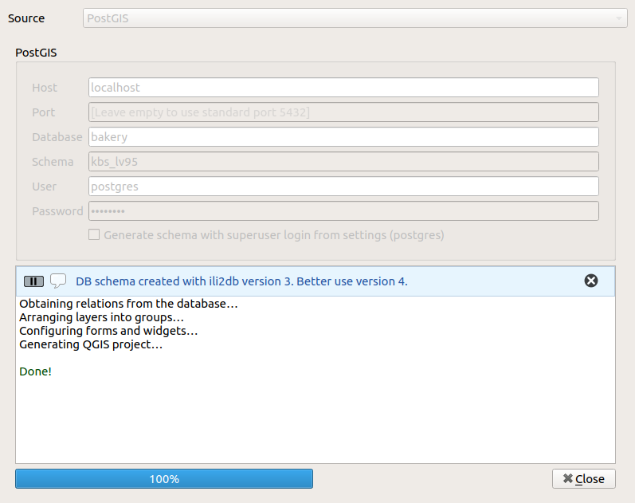
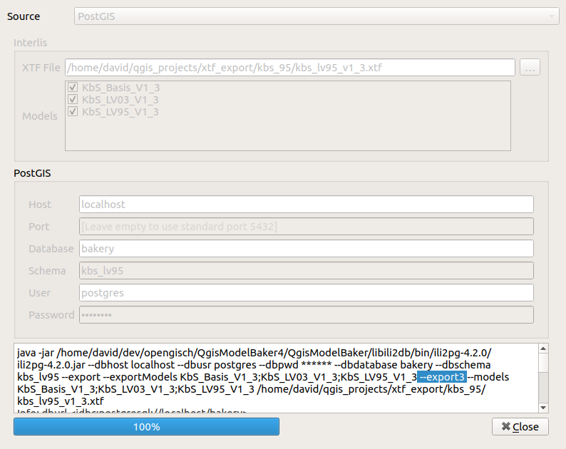
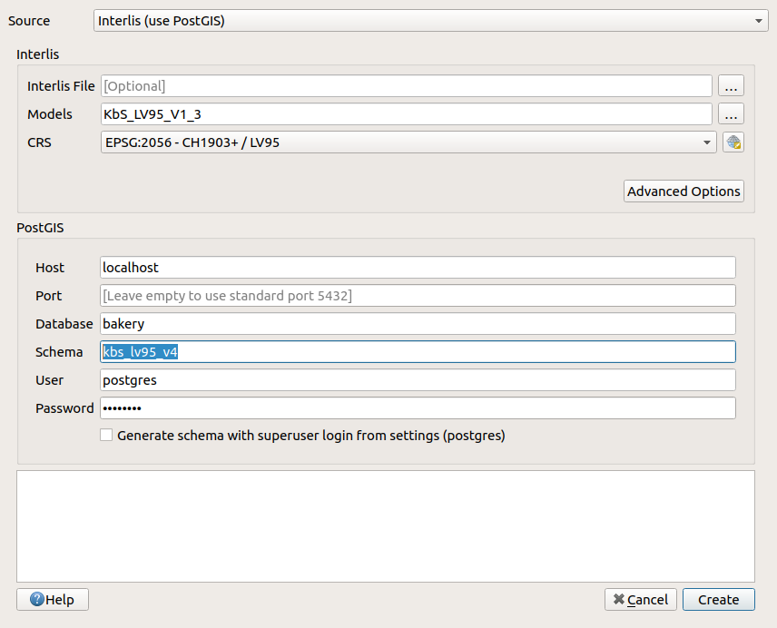
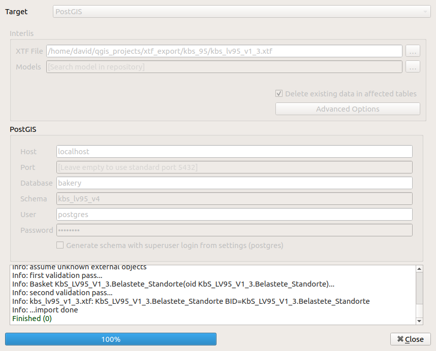

If you have databases created with ili2db of version 3, you may see a message like this:

Databases created with ili2db version 3 are still supported by Model Baker, but it's suggested to upgrade them to the currently used version 4 of ili2db.

It's super easy to do that with Model Baker.

## 1. Export Data

First export your data to an XTF file.

It's exported with ili2db 4, but with the paramter `--export3`, enabling the export of the databases created with ili2db 3.

## 2. Create Database

Create your database according to the selected models.

It's imported with ili2db 4. Your database is now on the current state of version 4.

## 3. Import Data

Import your data back again.

And it's done.
