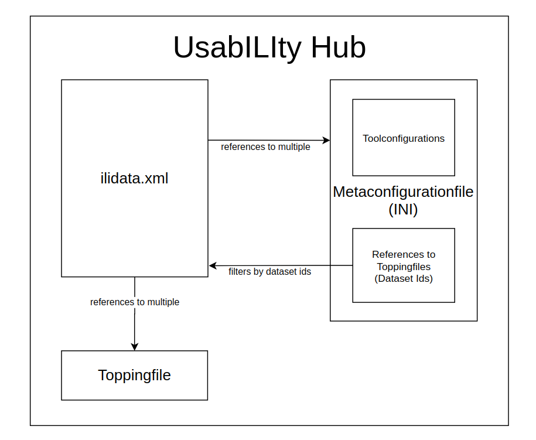

The idea of the UsabILIty Hub is to receive additional information for implemented INTERLIS models automatically via the web.
Just as we can get models by linking the ilimodels.xml file from http://models.interlis.ch and the linked repositories, we can get the additional information with the ilidata.xml file on the UsabILIty Hub (currently https://models.opengis.ch) and the linked repositories.

Settings for tools (like ili2db or Model Baker) are configured in a metaconfiguration file, as well as links to topping files that contain information about GIS project (such as symbologies or legend structures). Thus, this additional information usually consists of a metaconfiguration and any number of toppings.



## The ilidata.xml
An *ilidata.xml* serves as an index for all required additional information. The file is based on the [`DatasetIdx16`](http://models.interlis.ch/core/DatasetIdx16.ili) model.

It contains the class (elements) `DatasetMetadata`. There  are files referenced that are on the same server/repository as the *ilidata.xml*.

Additional servers/repositories can be linked via the `ilisite.xml`. The `DatasetMetadata` are identified by a cross-system (cross-repository) *DatasetMetadata-Id*. It is up to the user what this id is.

### Example of a `DatasetMetadata` element
```xml
<DatasetIdx16.DataIndex.DatasetMetadata TID="be6623c1-aa64-4a07-931e-fc4f0745f025">
  <id>ch.opengis.ili.config.KbS_LV95_V1_4_config_V1_0</id>
  <version>2021-01-06</version>
  <owner>mailto:david@opengis.ch</owner>
  <title>
    <DatasetIdx16.MultilingualText>
      <LocalisedText>
        <DatasetIdx16.LocalisedText>
          <Language>de</Language>
          <Text>Einfaches Styling und Tree (OPENGIS.ch)</Text>
        </DatasetIdx16.LocalisedText>
      </LocalisedText>
    </DatasetIdx16.MultilingualText>
  </title>
  <categories>
    <DatasetIdx16.Code_>
      <!--  dieser Eintrag betrifft das Modell KbS_LV95_V1_4  -->
    	<value>http://codes.interlis.ch/model/KbS_LV95_V1_4</value>
      <!--  Konvention: http://codes.interlis.ch/model/{MODELNAME}  -->
    </DatasetIdx16.Code_>
    <DatasetIdx16.Code_>
      <!--  dieser Eintrag betrifft eine Metakonfigurationsdatei -->
    	<value>http://codes.interlis.ch/type/metaconfig</value>
      <!--  fix Wert fuer Metaconfigs  -->
    </DatasetIdx16.Code_>
    <DatasetIdx16.Code_>
      <!--  Codes können auch generisch sein  -->
    	<value>http://codes.opengis.ch/modelbaker</value>
      <!--  müssen aber eine URL sein  -->
    </DatasetIdx16.Code_>
  </categories>
  <files>
    <DatasetIdx16.DataFile>
      <fileFormat>text/plain;version=2.3</fileFormat>
      <file>
        <DatasetIdx16.File>
          <path>metaconfig/opengisch_KbS_LV95_V1_4.ini</path>
          <!--  realtiver Pfad (zu ilidata.xml) der Metaconfig Datei  -->
        </DatasetIdx16.File>
      </file>
    </DatasetIdx16.DataFile>
  </files>
</DatasetIdx16.DataIndex.DatasetMetadata>
```

### Filtering
The `categories` element in the `DatasetMetadata` contains a list of `Code_` elements. These can be used for filtering. In the context of the UsabILIty Hub, the following two categories are primarily used.

#### Model
The category for the model is identified with the prefix http://codes.interlis.ch/model/ and contains the model name.
```xml
<DatasetIdx16.Code_>
  <value>http://codes.interlis.ch/model/KbS_LV95_V1_4</value>
</DatasetIdx16.Code_>
```

#### Type
The category for the file type is identified with the prefix http://codes.interlis.ch/type/ and contains the type in question.
```xml
<DatasetIdx16.Code_>
  <value>http://codes.interlis.ch/type/metaconfig</value>
</DatasetIdx16.Code_>
```

In the UsabILIty Hub implementation of the Model Baker, the following types are used:
- `metaconfig` to describe that it is a *metaconfiguration file*.
- `metaattributes` to describe that it is a meta attribute file written in TOML
- `sql` to describe that it is a SQL query file that can be used when creating the database
- `projecttopping` to describe that it is a *toppingfile* that defines a qgis project setting (includes the full layertree implementation and replaces that)
- `layerstyle` to describe that it is a *toppingfile* that can contain styling and form configurations for a QGIS layer written in QML
- `layerdefinition` to describe that it is a *toppingfile* that can contain the definition of a QGIS layer written in QLR
- `referenceData` to describe that it is a data file (e.g. a transfer file or a catalog)

#### Generic
However, the content of the `Code_` element is not strictly defined. As long as it is a URL, it is up to the tool developer how she wants to use it.

> At the moment the Model Baker does not use generic categories.

## The ilisite.xml
The *ilisite.xml* is based on the model `IliSite09`. It contains the class (elements) `SiteMetadata` where URLs to other repositories are defined. These repositories in turn manage an *ilimodel.xml* or - likewise - an *ilidata.xml*.

Thus, models can be found across multiple repositories and so can *metaconfigurationfiles* and/or *toppingfiles*.


### Example of a `IliSite09` element
```xml
<IliSite09.SiteMetadata.Site TID="1">
  <Name>usability.opengis.ch</Name>
  <Title>Allgemeine metadaten für ili-modelle</Title>
  <shortDescription>Weitere Sites des UsabILItyHubs</shortDescription>
  <Owner>http://models.opengis.ch</Owner>
  <technicalContact>mailto:david@opengis.ch</technicalContact>
  <subsidiarySite>
    <IliSite09.RepositoryLocation_>
      <value>usabilitydave.signdav.ch</value>
    </IliSite09.RepositoryLocation_>
  </subsidiarySite>
</IliSite09.SiteMetadata.Site>
```

## The Metaconfiguration File (`ini`)

A *metaconfigurationfile* is an `ini` file that contains configurations for one or more tools. Likewise, *topping files* and other files belonging to the configuration can be referenced in this *metaconfiguration file*.

### File References
The files are either referenced by a cross-system-wide *DatasetMetadata-Id* or they can be referenced by a static file path.
#### DatasetMetadata Id
When a file is referenced by a *DatasetMetadata-Id*, it means that the `ilidata.xml` are parsed across repositories to find the linked file. This means that the *metaconfiguration* cannot only reference files on the same repository/server. Prefix for *DatasetMetadata-Ids* is `ilidata:`.

It is generally recommended to use the *DatasetMetadata-Id* for a reference to a file (instead of the static file path).

#### Static File Path
Static file path links referenced with `file:` can be both absolute and relative. However, it may depend on the tool used to what the path is relative. Therefore this should only be used for testing purposes.

> The Model Baker handles relative paths relative to itself. ili2db on the other hand relative to the directory where *ili2db* is started.


```ini
[CONFIGURATION]
baseConfig=ilidata:remoteBaseConfigBasketId;ilidata:otherRemoteBaseConfigBasketId;path/otherBaseConfigLocalFile
org.interlis2.validator.config=ilidata:ilivalidatorConfigBasketId
qgis.modelbaker.projecttopping=ilidata:ch.opengis.config.KbS_LV95_V1_4_projecttopping
ch.interlis.referenceData=ilidata:ch.opengis.config.KbS_Codetexte_V1_4

[ch.ehi.ili2db]
defaultSrsCode = 2056
smart2Inheritance = true
strokeArcs = false
importTid = true
createTidCol = false
models = KbS_Basis_V1_4
preScript=ilidata:ch.opengis.config.KbS_LV95_V1_4_prescript
iliMetaAttrs=ilidata:ch.opengis.config.KbS_LV95_V1_4_toml

[qgis.modelbaker.ch]
"Belasteter_Standort (Geo_Lage_Polygon)"=file:toppings_in_modelbakerdir/layerstyle/opengisch_KbS_LV95_V1_4_001_belasteterstandort_polygon.qml
"Belasteter_Standort (Geo_Lage_Punkt)"=ilidata:ch.opengis.topping.opengisch_KbS_LV95_V1_4_001
ZustaendigkeitKataster=ilidata:ch.opengis.configs.KbS_LV95_V1_4_0032
```

For example, the id `ch.opengis.configs.KbS_LV95_V1_4_projecttopping` references a `DatasetMetadata` that contains a link to a `yaml` file where the project settings like the legend structure is defined. The id `ch.opengis.configs.KbS_LV95_V1_4_001` points to a `DatasetMetadata` element which contains a link to an `qml` file for QGIS style and form configurations.

Whole sections can also be defined. The section `qgis.modelbaker.qml` contains besides the link also the mapping of layer names to `qml` files. The mapping in the metaconfigurationfile is deprecated. This should be done in the project topping file.

### Tool Prefix
In the *metaconfiguration file* entries can be marked with a tool prefix. ili2db for example uses the prefix `ch.ehi.ili2db` and the Model Baker uses the prefix `qgis.modelbaker`. However, it is up to the tool which configurations it uses. The prefix `ch.interlis`, which is used with `ch.interlis.referenceData` for example for the reference to *data files* like catalogs or transfer data files, is used by ili2db as well as the Model Baker.

### References to other Metaconfiguration Files
It is also conceptually possible (although not yet implemented by tools like the Model Baker) that one can link from one *metaconfiguration file* to other *metaconfiguration files* using the `baseConfig` entry. Thus a kind of "inheritance" of the configuration would be possible.

## Topping Files
*Topping files* are files that are referenced by the *metaconfiguration* and contain the configuration information of a GIS project. They can be form configurations, style attributes, legend display and order, as well as catalogs, transfer files and other data files. Individual topping files can be used for each tool. From a simple zip file containing the whole project to a careful mapping of layer names to `qml` style files.

### Example of a Projecttopping File (`yaml`) of the Layertree in QGIS
```yaml
layertree:
  - 'top-group':
      group: true
      checked: true
      expanded: true
      mutually-exclusive: true
      mutually-exclusive-child: -1
      child-nodes:
        - 'geom punkt':
            group: false
            definitionfile: "ilidata:ch.opengis.topping.opengisch_KbS_LV95_V1_4_005"
        - 'geom polygon':
            group: false
            checked: true
            qmlstylefile: "ilidata:ch.opengis.topping.opengisch_KbS_LV95_V1_4_005"
        - 'subgroup':
            group: true
            child-nodes:
              - 'subsubgroup':
                  group: true
                  checked: true
                  child-nodes:
                    - 'baum':
                        group: false
                        checked: true
                    - 'subsubsubgroup':
                        group: true
                        checked: true
                        child-nodes:
                          - 'another layer':
                              group: false
                              checked: false
                    - 'layer in the subgroup':
                        group: false
                        checked: false
  - "Map":
        provider: "wms"
        uri: "contextualWMSLegend=0&crs=EPSG:2056&dpiMode=7&featureCount=10&format=image/jpeg&layers=ch.bav.kataster-belasteter-standorte-oev_lines&styles=default&url=https://wms.geo.admin.ch/?%0ASERVICE%3DWMS%0A%26VERSION%3D1.3.0%0A%26REQUEST%3DGetCapabilities"

layer-order:
  - 'geom punkt'
  - 'geom polygon'
```
