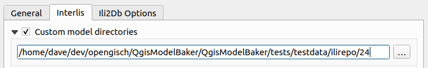
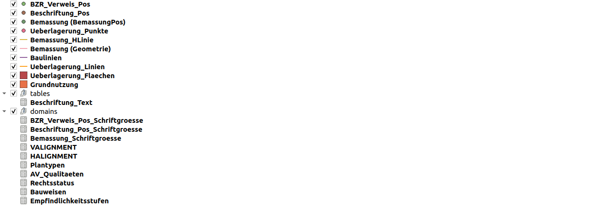
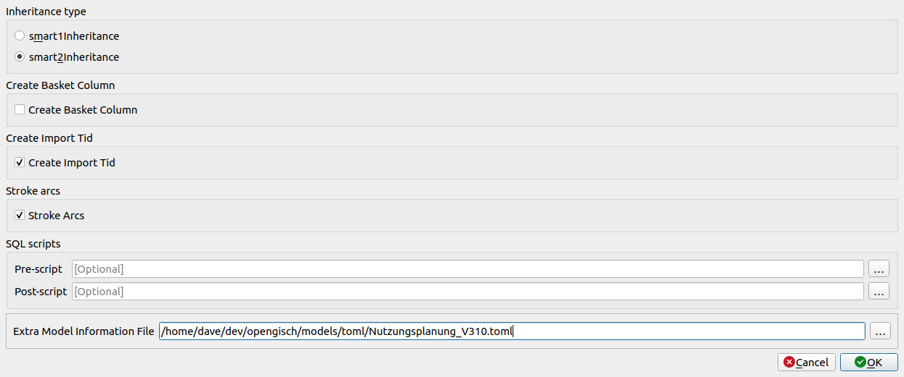
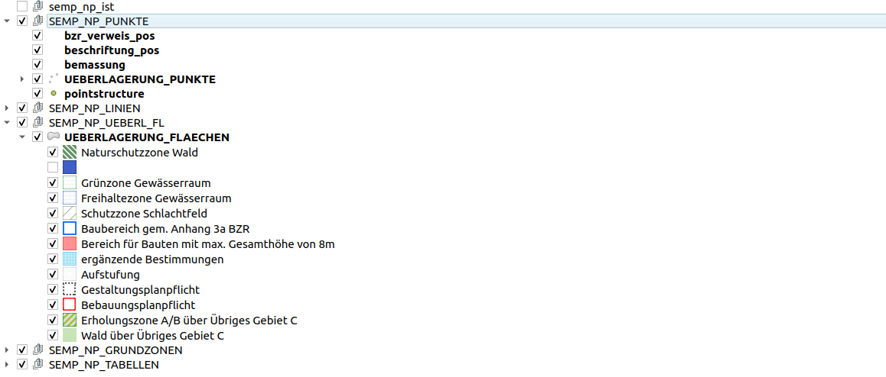
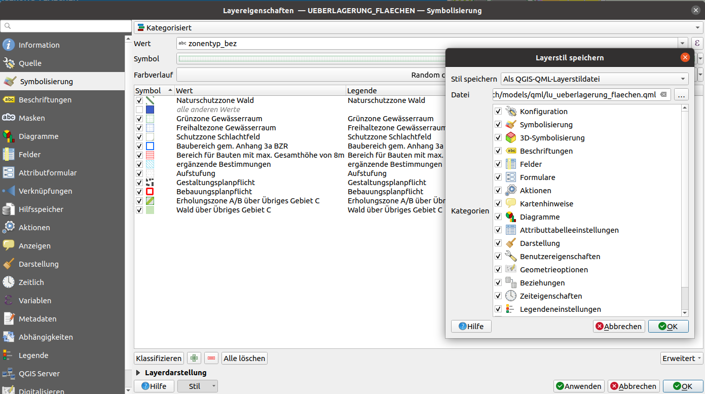

In order to publish your own toppings, you have to create and test them locally. In the future, tools should also take over some work steps (such as the export of the layertree and layer configurations). Until then, the following points are to be carried out, as in the example of the INTERLIS model Nutzungsplan of Lucerne.

## Realization of toppings for *Nutzungsplanung_V310*
The following topping files will be created or adapted:

- ilidata.xml (will be adjusted manually)
- Metaconfiguration file (will be created manually)
- Layer configurations `qml` files (will be generated with QGIS)
- Layer display order and legend `yaml` file (will be created manually)
- ili2db meta attribute file required for project creation `toml` file (created manually)


### 1. Preparation
It is recommended to place the files in one directory and name the following subdirectories:

```
.
├── ilidata.xml
├── projecttopping
├── metaconfig
├── layerstyle
├── layerdefinition
├── referencedata
├── sql
└── metaattributes
```

#### Local project generation
Configure your folder as a [custom model directory](../../../user_guide/plugin_configuration/#custom-model-directories). `ilidata.xml` and `ilimodels.xml` are searched and parsed in it.



In order to test the INTERLIS models locally, they should also be placed in the local folder:
```
.
├── additional_local_ini_files
│   ├── CHBase_Part1_GEOMETRY_20110830.ili
│   ├── CHBase_Part2_LOCALISATION_20110830.ili
│   ├── CHBase_Part3_CATALOGUEOBJECTS_20110830.ili
│   ├── CHBase_Part4_ADMINISTRATIVEUNITS_20110830.ili
│   ├── CoordSys-20151124.ili
│   ├── Nutzungsplanung_V310.ili
│   └── Units-20120220.ili
```

Now you can already generate the project locally:


Or with a ili2db metaattribute `toml` file.



The metaatribute `toml` file was created for the Nutzungsplan project. This file is specified in the Model Baker under "Advanced Options" and "Extra Model Information File" and will also be included via the UsabILIty Hub in the following steps:



#### Project Configuration in QGIS

In the created project, styles, forms, layer structures, etc. can now be configured in order to use this data as a source for the creation of the topping files.

If an implementation of this project already exists, this information can also be taken from it.



### 2. Creating Toppingfiles

#### Layer style (`qml` Files)
From the QGIS project, with already defined layer properties, first the `qml` files are saved.

*Layer properties > Style > Save layer style*



(or *Right-click on the layer > Export > Save as QGIS Layer Style File...*)

In this example the `qml` files were named as the layers are called with prefix "lu_".

---
**Problem with forms in case of the original *Nutzungsplanung_V310* project**

The original project does not contain the same layer names as the newly generated project. This may be the case because it was created with an old Model Baker version or because the layers were renamed later.
In the case of the form configurations, references were thus made to layers that no longer exist. If this configuration is now loaded via a `qml` file, QGIS notices and loads the required layer based on this information. And this leads to multiple layers being loaded into the project.

To prevent this, it is recommended to load the `qml` files into the locally generated (new) project as a test. If this (or other) problem occurs, only single categories from the original project can be used. In the case of *Nutzungsplanung_V310* the category "Forms" for certain layers was not taken from the original project, but in the layer of the locally generated project (which corresponds to the original layer except for the form configuration), the forms were configured manually, and the style was saved again as `qml` file.

---

#### Project topping (`yaml` File)

In a `yaml` file the project information like the layer display order and the legend tree structure is defined.
As well the QML files can be linked here.

Under main entry `layertree` the legend tree structure is defined and under `layer-order` the display order.

So the content of a `yaml` file can look like this:
```yaml
layertree:
  - "Geometrie-Layer":
      group: true
      expanded: true
      child-nodes:
        - "Punkt":
            featurecount: true
        - "Fläche":
        - "Linie":
            checked: true
  - "Informationen":
      group: true
      checked: true
      child-nodes:
        - "Unterhalt":
        - "Deponietypen":

layer-order:
  - "Punkt"
  - "Linie"
  - "Fläche"
```
For this, the correct indentation and structure of [YAML](https://de.wikipedia.org/wiki/YAML) must be observed.

Definition possibilities are:
- Layer/group visible or not: `checked: true`, if not: `checked: false`.
- Legend entry is considered as a group, i.e. it has other entries (child-nodes): `group: true`.
- Legend entries in the group are listed under `child-nodes`.
- Lower legend entries (children or symbolization categories) visible/expanded are: `expanded: true`.
- Visibility of layers in a group are mutually exclusive `mutually-exclusive: true` (that means only one child is visible at a time)
- The number of features within a layer can be displayed with:`featurecount: true`.

Each entry can have additional `child-nodes`, so the `layertree` can have any number of layers.


```yaml
  - "SEMP_NP_PUNKTE":
      group: true
      checked: true
      expanded: true
      child-nodes:
        - "BZR_Verweis_Pos":
            checked: true
            qmlstylefile: "ilidata:ch.lu.topping.Nutzungsplanung_V310_bzr_verweis_pos"
        - "Beschriftung_Pos":
            checked: true
            qmlstylefile: "ilidata:ch.lu.topping.Nutzungsplanung_V310_beschriftung_pos"
        - "Bemassung (BemassungPos)":
            checked: true
            featurecount: true
            qmlstylefile: "ilidata:ch.lu.topping.Nutzungsplanung_V310_bemassung_pos"
        - "Ueberlagerung_Punkte":
            checked: true
            expanded: true
            qmlstylefile: "ilidata:ch.lu.topping.Nutzungsplanung_V310_ueberlagerung_punkte"
```

The `qml` layer style toppings can be linked with `qmlstylefiles` and the `qlr` with `definitionfile`.
#### Metaattribute File for ili2db (`toml` File)
Also the `toml` file can be used as topping. This is written in INI format and already exists for the *Nutzungsplanung_V310*:

Content of `Nutzungsplanung_V310.toml`:
```
["Nutzungsplanung_V310.MultiPoint"]
ili2db.mapping=MultiPoint

["Nutzungsplanung_V310.MultiSurface"]
ili2db.mapping=MultiSurface
```

#### Transfer files (e.g. Catalogs) (`xtf`/`xml`/`itf` Files)
Transfer files such as catalogs can also be used as toppings. In the project *Nutzungsplanung_V310*, however, none were specified.

For information and examples about the referencing of those files see in the [Model Baker Integration](../modelbaker_integration/#catalogs-and-transfer-files)

### 3. Storage and Indexing of the Toppings

#### Storage
The topping files can now be stored in the folders intended for them:
```
.
├── projecttopping
│   ├── layertree_Nutzungsplanung_V310.yaml
├── metaconfig
│   ├── lu_nutzungsplanung_v310.ini
├── layerstyle
│   ├── lu_baulinien.qml
│   ├── lu_bemassung_geometrie.qml
│   ├── lu_bemassung_hlinie.qml
│   ├── lu_bemassung_pos.qml
│   ├── lu_beschriftung_pos.qml
│   ├── lu_beschriftung_text.qml
│   ├── lu_bzr_verweis_pos.qml
│   ├── lu_grundnutzung.qml
│   ├── lu_ueberlagerung_flaechen.qml
│   ├── lu_ueberlagerung_linien.qml
│   ├── lu_ueberlagerung_punkte.qml
└── metaattributes
    ├── Nutzungsplanung_V310.toml

```
#### Indexing in the ilidata.xml

The `ilidata.xml` is the "register" over which the topping files are found.

For the structure of the file based on the [`DatasetIdx16`](http://models.interlis.ch/core/DatasetIdx16.ili) see the [Technical Concept](../technical_concept/#the-ilidataxml).

Basically, a repository-wide unique id must be assigned. It does not have to be descriptive for the content. Further the type of the topping must be entered in the `categories`, as well as the relative `path` to the file concerned.

So the entry for the topping file "layerstyle/lu_grundnutzung.qml" of the type "layerstyle" with the id "ch.lu.topping.Nutzungsplanung_V310_grundnutzung" would be the following:
```xml
      <DatasetIdx16.DataIndex.DatasetMetadata TID="3dcc47e5-1dd5-4f05-9fc8-756125705a2c">
        <id>ch.lu.topping.Nutzungsplanung_V310_grundnutzung</id>
        <version>2021-01-20</version>
        <owner>mailto:zsanett@opengis.ch</owner>
        <categories>
          <DatasetIdx16.Code_>
            <value>http://codes.interlis.ch/type/layerstyle</value>
          </DatasetIdx16.Code_>
        </categories>
        <files>
          <DatasetIdx16.DataFile>
            <fileFormat>text/plain;version=2.3</fileFormat>
            <file>
              <DatasetIdx16.File>
                <path>layerstyle/lu_grundnutzung.qml</path>
              </DatasetIdx16.File>
            </file>
          </DatasetIdx16.DataFile>
        </files>
      </DatasetIdx16.DataIndex.DatasetMetadata>
```
### 4. The metaconfiguration (`ini` file)

The metaconfiguration is the file that holds everything together. Find more information in the [Technical Concept](../technical_concept/#the-metaconfiguration-file-ini).

For the implementation of *Nutzungsplanung_V310*, the topping files created in the previous steps must now be linked in the metaconfiguration file via their Id assigned in `ilidata.xml`.

```ini
[CONFIGURATION]
qgis.modelbaker.projecttopping=ilidata:ch.lu.topping.layertree_Nutzungsplanung_V310

[ch.ehi.ili2db]
iliMetaAttrs=ilidata:ch.lu.topping.npluzern_toml
```

There is an deprecated way of assigning the `qml` layer style toppings to the correct names of the corresponding layers. Better practice is to add them in the layertree of the project topping file (`yaml`).

```ini
[qgis.modelbaker.qml]
"BZR_Verweis_Pos"=ilidata:ch.lu.topping.Nutzungsplanung_V310_bzr_verweis_pos
"Beschriftung_Pos"=ilidata:ch.lu.topping.Nutzungsplanung_V310_beschriftung_pos
"Bemassung (BemassungPos)"=ilidata:ch.lu.topping.Nutzungsplanung_V310_bemassung_pos
"Ueberlagerung_Punkte"=ilidata:ch.lu.topping.Nutzungsplanung_V310_ueberlagerung_punkte
"Bemassung_HLinie"=ilidata:ch.lu.topping.Nutzungsplanung_V310_bemassung_hlinie
"Baulinien"=ilidata:ch.lu.topping.Nutzungsplanung_V310_baulinien
"Ueberlagerung_Linien"=ilidata:ch.lu.topping.Nutzungsplanung_V310_ueberlagerung_linien
"Grundnutzung"=ilidata:ch.lu.topping.Nutzungsplanung_V310_grundnutzung
"Bemassung (Geometrie)"=ilidata:ch.lu.topping.Nutzungsplanung_V310_bemassung_geometrie
"Ueberlagerung_Flaechen"=ilidata:ch.lu.topping.Nutzungsplanung_V310_ueberlagerung_flaechen
"Beschriftung_Text"=ilidata:ch.lu.topping.Nutzungsplanung_V310_beschriftung_text
```

#### Indexing in the ilidata.xml

Also the metaconfiguration file must be entered in `ilidata.xml`. Only then it can be found by tools like Model Baker.

Basically exactly the same as a topping file. A repository-spanning unique Id, the type in the `categories` as well as the relative `path` to the file.
```xml
      <DatasetIdx16.DataIndex.DatasetMetadata TID="a2acb2f5-38bd-4d1a-8af0-c2463dcb5b66">
        <id>ch.opengis.ili.config.Nutzungsplanung_V310</id>
        <version>2021-03-12</version>
        <owner>mailto:zsanett@opengis.ch</owner>
        <categories>
          <DatasetIdx16.Code_>
          	<value>http://codes.interlis.ch/type/metaconfig</value>
          </DatasetIdx16.Code_>
        </categories>
        <files>
          <DatasetIdx16.DataFile>
            <fileFormat>text/plain;version=2.3</fileFormat>
            <file>
              <DatasetIdx16.File>
                <path>metaconfig/lu_nutzungsplanung_v310.ini</path>
              </DatasetIdx16.File>
            </file>
          </DatasetIdx16.DataFile>
        </files>
      </DatasetIdx16.DataIndex.DatasetMetadata>
```

To find this metaconfiguration file according to the model name (here *Nutzungsplanung_V310*) this must also be entered in the `categories`. Additionally, it needs a `title` so that it can be recognized in the [GUI of the Model Baker](../../../user_guide/import_workflow/#import-of-interlis-data). The `shortDescription` is optional and serves to further describe the content of the metaconfiguration.

This is how the entry finally looks like:
```xml
      <DatasetIdx16.DataIndex.DatasetMetadata TID="a2acb2f5-38bd-4d1a-8af0-c2463dcb5b66">
        <id>ch.opengis.ili.config.Nutzungsplanung_V310</id>
        <version>2021-03-12</version>
        <owner>mailto:zsanett@opengis.ch</owner>
        <title>
          <DatasetIdx16.MultilingualText>
            <LocalisedText>
              <DatasetIdx16.LocalisedText>
                <Language>de</Language>
                <Text>Styling und Tree für PostgreSQL Projekt für den Kanton Luzern (lu.ch)</Text>
              </DatasetIdx16.LocalisedText>
            </LocalisedText>
          </DatasetIdx16.MultilingualText>
        </title>
        <shortDescription>
          <DatasetIdx16.MultilingualMText>
            <LocalisedText>
              <DatasetIdx16.LocalisedMText>
                <Language>de</Language>
                <Text>Die Metakonfiguration für ein PostgreSQL Projekt generiert mit dem Model Nutzungsplan_V310 enthält Links zu Layertree Struktur, TOML und QML Files.</Text>
              </DatasetIdx16.LocalisedMText>
            </LocalisedText>
          </DatasetIdx16.MultilingualMText>
        </shortDescription>
        <categories>
          <DatasetIdx16.Code_>
          	<value>http://codes.interlis.ch/model/Nutzungsplanung_V310</value>
          </DatasetIdx16.Code_>
          <DatasetIdx16.Code_>
          	<value>http://codes.interlis.ch/type/metaconfig</value>
          </DatasetIdx16.Code_>
        </categories>
        <files>
          <DatasetIdx16.DataFile>
            <fileFormat>text/plain;version=2.3</fileFormat>
            <file>
              <DatasetIdx16.File>
                <path>metaconfig/lu_nutzungsplanung_v310.ini</path>
              </DatasetIdx16.File>
            </file>
          </DatasetIdx16.DataFile>
        </files>
      </DatasetIdx16.DataIndex.DatasetMetadata>
```
