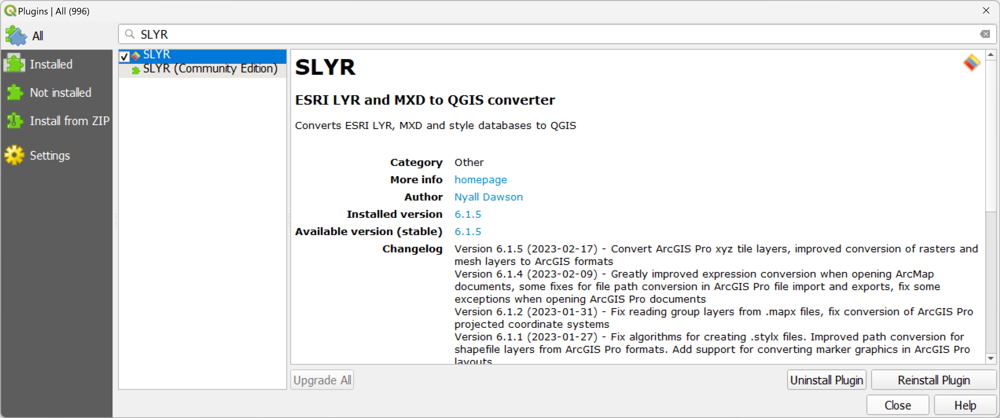

# FAQ

Have a question? Check the entries below for an answer.
> If the answer to your question is not here, please email us
> at [North Road Support](mailto:info@north-road.com)

## How much does SLYR cost?

See the [pricing](pricing) page for full details on purchasing the
full-featured
licensed version of SLYR.

## How many users will a licence cover?

A single **SLYR** licence agreement covers use by 20 users in the same physical
location i.e. an office address. It will also cover remote users that are
attached to the defined physical location. If you have multiple locations, or
over 20 users that require use of the licence, please
let [us](mailto:info@north-road.com) know, and we will assess each case on an
individual basis.

## How can I purchase SLYR?

If you would like to purchase SLYR [email us](mailto:info@north-road.com). As
we often deal with
clients in Europe and America, there is often a lag due to the time differences
as we are located in Queensland, Australia (AEST, GMT+10).

To speed up the process, include the details below in your email so that we can
produce an invoice for you straight away. If you need a quote first, let us
know in the email and provide the same details listed below.

To create an invoice or quote, we require the following information:

> Organisation name/Your name
>
> Office address
>
> VAT number (if in Europe)
>
> Purchase order number (if required)
>
> Expected number of users
>
> Type of users (in office/remote)

When we receive payment (via credit card or bank transfer), we will send
you the licence and instructions for using **SLYR**.

## Can remote users use my SLYR license?

We work remotely too, so we know how you need to have access to all of your
tools! If you are attached to an office location, but work remotely, you are
covered under our license agreement.

## Are student versions available?

Unfortunately we do not offer a student version of **SLYR**. We recommend you
approach your institution to purchase **SLYR**.

## What support is available for SLYR?

North Road offers a high level of support to all **SLYR** purchases. You can
contact us at anytime via [email](mailto:info@north-road.com).

> - If there is a bug we will fix it to the best of our abilities and release
    it as soon as we can.
> - If you wish a tool to work in a certain way i.e. develop a new feature, and
    if there are no barriers to developing it (software constraints in
    QGIS/ESRI), we will attempt to do it.
> - If it is something that will require a high level of development, you can
    consider whether to join the current **Hall of Fame** and sponsor its
    development.

## Can I get a trial version of SLYR?

Evaluation versions of the tool are not available. If you require a sample to
evaluate prior to purchasing, email QGIS or ESRI files
to [North Road Support](mailto:info@north-road.com), and we will convert them
at
no cost for your evaluation.

## How do I get the latest version of SLYR?

SLYR is updated many times during the year, at least once per quarter. To find
out what has been updated in the latest version, check out the changelog in
the `QGIS Plugin Manager`.
Checkout [Troubleshooting](troubleshooting) on how to update your **SLYR**
version.

## What licences do I need?

SLYR is designed so that you can push out ESRI products **without** the need of
an
ESRI licence! You do **NOT** need to have any ESRI software installed in order
to
use SLYR. You only need to have [QGIS](https://www.qgis.org/en/site/)
installed.

## What QGIS version do I need?

We always recommend running either the latest QGIS release or the current
QGIS "LTR" release. However, SLYR is compatible with older versions of QGIS,
anything from version 3.16 onwards can be used.

## How can I run SLYR tools outside QGIS?

While it's possible to call the **Python** modules directly from standalone
scripts, this is not recommend and is not officially supported by **North Road
**. However, the official endorsed way of running the tools outside **QGIS**
is to use the `qgis_process` CLI application which comes bundled with QGIS.

## File Formats

SLYR uses many file formats. If you're unfamiliar with these formats, check
the handy format glossary table below:

| **Format**         | **Description**                                                                                             | **Software Project** |
|--------------------|-------------------------------------------------------------------------------------------------------------|----------------------|
| Layer              | A map layer, eg a vector, raster, point cloud, etc layer                                                    | QGIS                 |
| QGIS style XML     | QGIS style file                                                                                             | QGIS                 |
| QGS                | QGIS project file, containing maps, layouts and other objects                                               | QGIS                 |
| QGZ                | A "zipped" QGIS project file                                                                                | QGIS                 |
| QLR                | QGIS layer definition File. Contains a link to a dataset and preset styling information                     | QGIS                 |
| QMD                | QGIS metadata file. Contains metadat for a map layer, such as author and credits.                           | QGIS                 |
| QML                | QGIS style file. Contains non-source specific styling information for a map layer.                          | QGIS                 |
| GPKG               | GeoPackage data format. An OGC standard format. Can contain multiple vector and raster layers.              | OGC                  |
| SLD                | Styled Layer Descriptor: XML descriptor, OGC standard method for storing map layer styling information.     | OGC                  |
| WMS                | Web Mapping Service                                                                                         | OGC                  |
| CSS                | Cascading style sheet                                                                                       | HTML                 |
| GPL                | Color palette file, containing multiple colors.                                                             | GIMP/QGIS            |
| Annotation classes | ESRI file that contains properties that determine how a subset of annotation in the feature class displays. | ESRI                 |
| APRX               | ArcGIS Pro Project template                                                                                 | ESRI                 |
| AVL                | ArcView style                                                                                               | ESRI                 |
| ESRI APTX          | ESRI labelling file that may be text or a graphic. It enables placement control by the user                 | ESRI                 |
| LYRX               | ArcGIS Pro layer file, containing links to a datasource and corresponding styling information               | ESRI                 |
| LYR                | ArcMap layer file, containing links to a datasource and corresponding styling information                   | ESRI                 |
| MAPX               | ArcGIS Pro map file. Contains links to multiple map layers and their styling information.                   | ESRI                 |
| MDB                | Personal GeoDatabase. An outdated ESRI format for vector data storage.                                      | ESRI                 |
| MXD                | ArcGIS project file. Contains multiple maps, layers and page layouts.                                       | ESRI                 |
| MXT                | ArcGIS map template. Similar to a MXD file.                                                                 | ESRI                 |
| PAGX               | ArcGIS Pro layout template file. Contains a page layout for use in ArcGIS Pro.                              | ESRI                 |
| PMF                | ArcMap ESRI published map for ArcReader. A "read-only" project format for use in ArcMap.                    | ESRI                 |
| PPRX               | ArcGIS Pro aprx zipped file                                                                                 | ESRI                 |
| Representations    | ArcMap symbol information stored inside feature classes within a GeoDatabase                                | ESRI                 |
| SDE                | ArcSDE connection file. Contains properties used for connecting to a SDE database.                          | ESRI                 |
| STYLE              | ArcGIS style library. Contains symbols and text formats for reuse across different projects.                | ESRI                 |
| STYLX              | ArcGIS Pro style library. Contains symbols and text formats for reuse across different projects.            | ESRI                 |
| SXD                | An ArcScene project. Contains the definition of map layers for display in a 3D viewer.                      | ESRI                 |
| VTPK               | Vector tile package. A self contained database containing vector tiles.                                     | ESRI                 |
