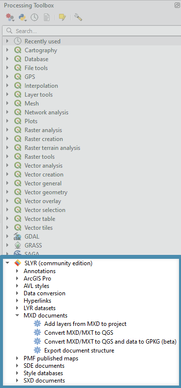

# Get Started
SLYR is available in two versions:
  
Version | Cost | Details
:-------: | :-----: |:------ 
SLYR  | €1200 | To purchase, contact [North Road](mailto:info@north-road.com).
SLYR (Community Edition) | Free | Access via QGIS Plugin Manager. 

Once purchased, **SLYR's** support is perpetual! 
>Users will get the latest tools via version updates at no extra cost:
> * No annual maintenance 
> * Update at your leisure using the **QGIS Plugin Manager**. 

## Install the **SLYR (Community Edition)**
To install the **SLYR (Community Edition)**, open the **Plugin Manager**, click on the top menu item `Plugins` ▶️ `Manage and Install Plugins`.

In the dialog that opens, type *SLYR* in the search bar. 

In the middle panel, click on the *SLYR (Community Edition)*  and then click on `Install Plugin`.

The Plugin Manager will then run the Install for you. When the install has completed, click on `Close`.

>Any further updates to the SLYR plugin will be available to you within the Plugin Manager. 

The **SLYR (Community Edition)** will appear in the browser panel. Expand the tools and start using them.

>The **SLYR (Community Edition)** has limited tools - check the [SLYR Blog](https://north-road.com/slyr/) for availability as we update tool accessibility once we have reached our funding goals.
>A tool will return an error if is is only available in the fullly licenced **SLYR**.
 
## Install the plugin (licensed version)
Once purchased, licensed users will receive an email from **North Road** with a link for the installer and their licence key. 

**Before installing the licensed version of SLYR, you must first uninstall the community version (if installed) and restart QGIS.**

1. Save the information in this email, along with your invoice and receipt in a safe place for future reference.

2. Download the installer from the link. 
      * Place the zip file in a safe location for future reference - just in case you need to update your machine so you can reload it.

3. Unzip the downloaded file, and then drag the extracted `install_slyr_qgis.py` over an open **QGIS** window. (If prompted, accept the warning regarding trusted scripts). The script will add a connection to the private plugins repository, and install the **SLYR** plugin for you.

4. After the plugin is installed, the **SLYR** `Options` dialog will open (If it doesn't, click on the top menu `Settings` ▶️ `Options` and click on **SLYR** in the left panel). Enter your unique license key at this screen, exactly as it appears at the end of this email. Enter the optional requirements outlined in the [SLYR Options section](/user_guide/setting_up_slyr_options).

6. Once installed, **SLYR** will appear in the browser panel. Expand the tools and start using them.

