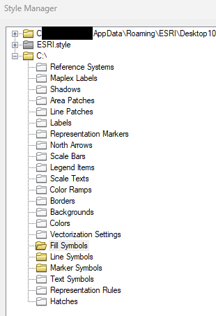

# Known Limitations

SLYR will always follow the developments in **ESRI** and **QGIS** to provide
conversion opportunities as new functionality is added to these applications.
However, there are limitations in both QGIS and ESRI software which can prevent
perfect results when converting documents between these applications.

This page lists limitations which we know can affect the quality of conversions
made by SLYR, along with any workarounds you can use to help avoid conversion
issues.

> If you encounter a limitation that isn't listed,
> please [email us](mailto:info@north-road.com) and we will investigate it.

<!--## Title

Description  

> **Workaround**
>
> instruction intro  

1. Instruction  

-->

## Content in Source files

SLYR will process and utilize any available content. If no content is present, SLYR will have nothing to convert.

> **Workaround**
>
> To check if the content exists, open up the source file in its native software and check to see if the content is there.  

- In this example, content exists only in the yellow folders. No content is illustrated as a white folder.  

## Graduated renderer

SLYR cannot translate a QGIS "graduated renderer" to any comparable result in
ArcGIS Pro when there are gaps between class ranges. ArcGIS Pro does not
support gaps within class breaks.

> **Workaround**
>
> Adjust the graduated class breaks from the QGIS project to remove any gaps between the
> class ranges. If values should remain hidden, try creating classes for these hidden ranges
> and using a fully transparent symbol for them.

## Legend Text

It is not possible to automatically wrap legend text in current QGIS versions. When converting
ESRI documents which use this option, SLYR will raise warnings but the resulting legend arrangement
in the QGIS project will often be messy and need manual adjustment.

> **Workaround**
>
> Avoid using automatically wrapped text in ArcMap or ArcGIS Pro legends

## Converting QGIS projects to MXD/LYR

SLYR does not support converting QGIS projects into the older ArcMap MXD or LYR formats.
However, it does support the conversion of QGIS projects to ArcGIS Pro formats
like LYRX, MAPX, and APRX. Since ArcMap is now officially ceased development by ESRI,
SLYR has concentrated its QGIS to ESRI conversion efforts on the newer, supported
ArcGIS Pro formats.

Consequently, SLYR does not support exports of QGIS to MXD (or LYR), and we will not
be adding this functionality in any future SLYR release.

> **Workaround**
>
> Export to the newer ArcGIS Pro formats instead

## Publishing to OS web services

If you are publishing to an OS web services, these are the current styling limitations you may experience:  
| Software | Impact | SLYR Tools |
| --- | --- | --- |
| QGIS Server | Close to a 1:1 match for the original ESRI rendering of layers | Convert the ESRI mxd/lyr/lyrx files to equivalent QGIS project |
| MapServer | Basic symbology converts well. For more complex symbology, further adjustments may be required. | Convert LYR/LYRX/MXD files to SLD files |
| GeoServer | Basic symbology converts well. For more complex symbology, further adjustments may be required. | Convert LYR/LYRX/MXD files to SLD files |

## Raster Catalog Layers

Raster Catalog layers are a special feature in ArcMap. (The ArcGIS Pro equivalent is mosaic
datasets.) In QGIS there is currently no equivalent to Raster Catalog or Mosaic Dataset layers.
Accordingly, SLYR cannot convert these layers and these layer types will be skipped over
when opening ArcMap or ArcGIS Pro documents.

> **Workaround**
>
> This functionality will become available only when QGIS itself supports raster catalog
> layers or mosaic datasets. If you're interested in funding this development within
> QGIS, please [contact us](mailto:info@north-road.com).

## Rule-based renderers

One of our favorite features of **QGIS** Symbology is the ability to create
efficient cartography through the use of "Rule-Based" renderers. This is an
extremely powerful functionality, with no direct equivalent in current ArcGIS
Pro versions. Therefore, if your **QGIS** project has many layers based on rule-based
renderers, you may have issues when exporting to ArcGIS Pro formats.

SLYR will always attempt to convert rule based layers whenever it **is** possible
to replicate the same results in ArcGIS Pro, but if this is not possible then
a warning will be raised during the export and the QGIS layer styling will need
to be adjusted accordingly.

> **Workaround**
>
> One potential workaround is to manually add a new field to the
> layer's attribute table which contains the name of each of rule which should
> be used to render that feature, and then convert the rule-based renderer
> to an equivalent categorized renderer using this new field.

1. In **QGIS**, open up a layer's `attribute table`.
2. Create the number of fields required to record each rule-based
   classification against the features.
3. Select the fields according to your filter used in the rule-based
   classification.
4. Populate the fields with the name of your rule-based classification.
5. Save your edits.
6. Change the layer to use a Categorized Renderer with symbology matching
   each of the original rule-based renderer rules.

## SLD - converting LYR/LYRX to SLD

These tools rely on QGIS' SLD export capabilities, and the quality
of the conversion will depend on the symbology options used in the ArcMap
documents and how compatible they are with QGIS' SLD support.

The SLD format itself has considerably less symbology functionality
compared with either QGIS or ArcMap, therefore a conversion to SLD
will often be a lossy process, dropping complex options back to simpler
SLD supported symbology.

> **Workaround**
>
> Carefully check the resulting SLD symbology and compare against the original
> ArcMap or ArcGIS Pro symbology. Where differences are present, try
> simplifying the original ArcMap/ArcGIS Pro symbology to use simpler styling
> choices.

## Symbology - Units

Current ArcGIS Pro versions do not support map unit based symbol sizes. If your QGIS symbology is using sizes with the "map units" or "meters at scale" types, you'll need to change the type to something compatible with ArcGIS Pro's capabilities.

> **Workaround**
>
> Modify your QGIS symbols to use a fixed-unit size instead (eg Millimeters)

## Urgent fixes

If you have a large project impacted by limitations that requires an urgent
fix, [contact us](mailto:info@north-road.com) and we can assist! In some cases we can:

- Undertake the conversion for you. This may attract a small fee, dependent on
  the work, but please ask.
- Missing functionality in QGIS can be sponsored so that we can directly
  add support for it.

> By asking us, you are letting us know of the limitation and by delivering a
> solution for you, it may help develop a solution for all users of these tools
> and all QGIS users!
