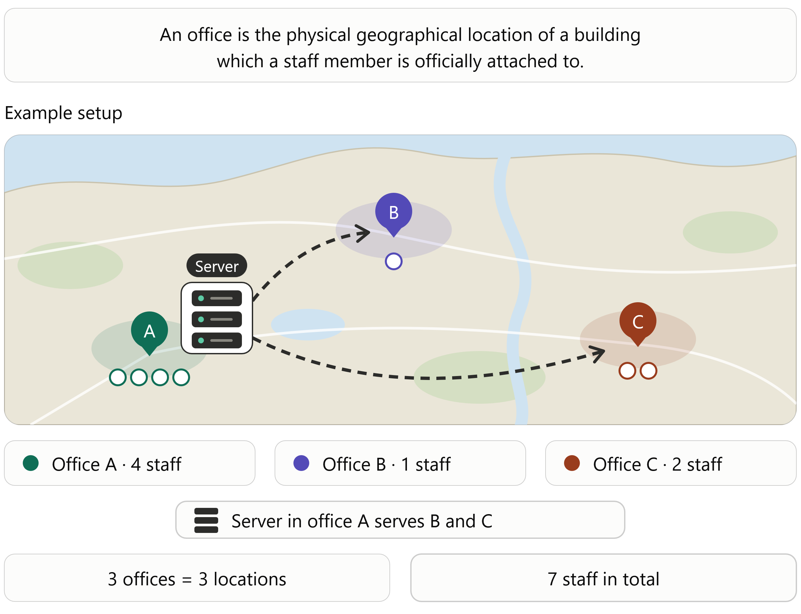

# SLYR Pricing

**SLYR** Plugin costs:

- Australia/NZ: AU$1950 (+10% GST for Australian customers)
- USA: USD$1850 (excluding taxes)
- Rest of the World: €1500 (excluding taxes) **This price excludes the VAT. The VAT B2B mechanism will be used on purchases, requiring that the purchasers must account for the tax themselves.**

This includes:

> - Access to **SLYR's** full set of tools
> - Multiple user access in the one physical location
> - Perpetual version updates
> - No annual maintenance
> - Full support from North Road

## Purchase process

If you would like to to purchase SLYR fill out the [Enquiry Order Form](https://north-road.com/slyr-enquiry-order-form/ )

We have found the process can take as little as 24 hours, dependent on your organisation's procurement process and time differences. As we are located in Queensland, Australia (AEST, GMT+10), note there is a time lag due to the time differences, particularly with purchasers in Europe and America.

When we receive payment (via credit card), we will send you the license and instructions for using **SLYR**.  

## Resellers

We’re happy to help you meet local purchasing requirements! [Contact us](mailto:info@north-road.com) to get connected with a preferred reseller in your country.  

## Locations and Licenses

Licenses are based on the physical location.  

The license allows staff to use **SLYR**:

- At the designated licensed office
- In the field
- Working remotely
- Traveling for work
