# SLYR Tools

## Before you start

Here is a checklist to help your conversions and workings with **SLYR** run a
little bit smoother.

> ✔️ **Populate settings requirements:**  set-up the **SLYR Options** following
> these [guidelines](configuring).
>
> ✔️ **Set up your folders:**  **SLYR** will record the pathways from the
> original data locations, so there is no need to have a special set-up.
> However,
> you may want to set-up a structure so you can keep outputs tidy.
>
> ✔️ **Access to files:**  ensure you have access to bespoke files such .svg,
> fonts, and images. Note that there is
> some [limitations](limitations) with
> QGIS Svg files.

See [Troubleshooting](troubleshooting)
for the workaround.
>
> ✔️ **Symbology:**  If you are using rule-based renderers, these are not yet
> available in ArcGIS Pro. See
> the [Limitations](limitations).
>
> ✔️ **Error Messages:**   If a tool returns an error:
> - Saying it is not available, if you are using the Community Edition, it may
    not yet be available.
> - All other errors, read through the `Log`, check
    the [Troubleshooting](troubleshooting)
    page on how to rectify the issue and rerun the tool. If there is no
    rectification, please [email us](mailto:info@north-road.com).
*** 

<!---## Group ##
### Tool ###
| From | To |
| ---- | ---|
| **ESRI** .aprx | **QGIS** .qgs, .qgz | 

Description

1. In the **QGIS** `Processing Toolbox`, click on `SLYR` ▶️ `Group` ▶️ `X`.
2. In the `Input X`, browse to the location of the *.X* file.
3. Under `Destination X`, set the location of the *.X* file.
4. Click `Run`.

> This tool is available only with the SLYR full license.
***
--->

## Annotations

If you are converting graphical or text annotations which are stored in an
ArcGIS Project file (eg a MXD, LYR, APRX, LYRX file) and the underlying data
source is NOT a File Geodatabase annotation class then use the corresponding
tool for converting this document type.

### Convert annotation classes to GeoPackage

| From          | To             |
|---------------|----------------|
| **ESRI** .gdb | **QGIS** .gpkg | 

Use this tool if you are converting text annotations stored in a File
Geodatabase annotation class and want the result to be reusable across
different projects.  
This tool will take an annotation class currently saved in a geodatabase and
convert it into a geopackage layer.
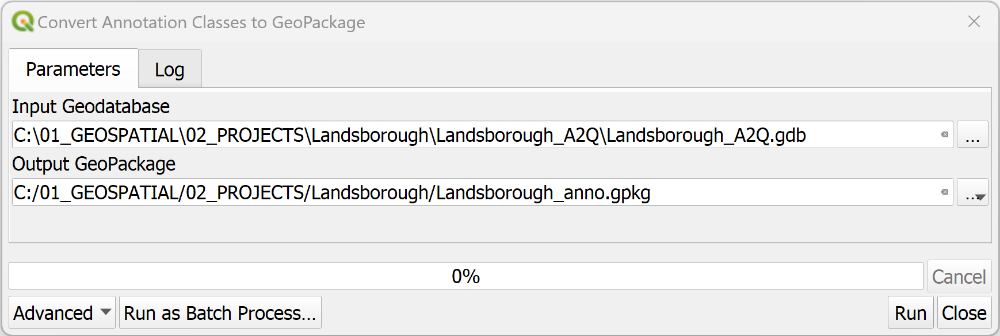

1. In the **QGIS** `Processing Toolbox`, click on `SLYR` ▶️ `Annotations`
   ▶️ `Convert annotation classes to GeoPackage`.
2. In the `Input Geodatabase`, browse to the location of the annotation file.
3. Under `Output GeoPackage`, set the location of the *.gpkg* file.

> This tool is available only with the SLYR full license.
***

### Convert Annotations

| From                      | To                          |
|---------------------------|-----------------------------|
| **ESRI** annotation layer | **QGIS** ? annotation layer | 

Use this tool if you are converting text annotations stored in a File
Geodatabase annotation class and just want the results added to the current
project.

1. In the **QGIS** `Processing Toolbox`, click on `SLYR` ▶️ `Annotations`
   ▶️ `Convert annotations`.
2. In the `Input layer`, select the annotation layer from within the Geodatabase.
3. Under `Element field`, select which field contains the annotation content. This is usually the `ELEMENT` field.
4. Click `Run`. The tool will convert the annotations from the annotation class and add to the current QGIS project as map annotations.

> This tool is available only with the SLYR full license.
***

## ArcGIS Pro

### Convert APRX to QGS

| From           | To                  |
|----------------|---------------------|
| **ESRI** .aprx | **QGIS** .qgs, .qgz | 

Converts an APRX document file to a QGS project file.

1. In the **QGIS** `Processing Toolbox`, click on `SLYR` ▶️ `ArcGIS Pro`
   ▶️ `Convert APRX to QGS`.
2. In the `Input APRX file`, browse to the location of the *.aprx* file.
3. Under `Destination QGS project file`, set the location of the *.qgs* file.
4. Click `Run`.
5. Once processed, in **QGIS**, navigate to the folder and open the *.qgs*
   file.

> This tool is available only with the SLYR full license.
***

### Convert QGS to APRX

| From                | To             |
|---------------------|----------------|
| **QGIS** .qgs, .qgz | **ESRI** .aprx |

Converts a QGIS project file to an APRX file.

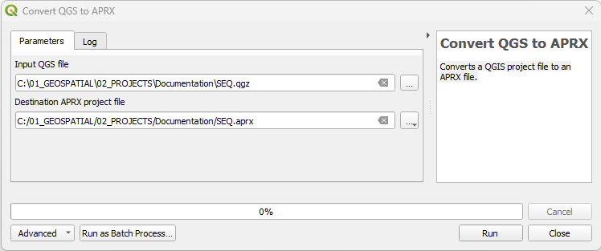

1. In the **QGIS** `Processing Toolbox`, click on `SLYR` ▶️ `ArcGIS Pro`
   ▶️ `Convert APRX to QGS`.
2. In the `Input QGS file`, browse to the location of the *.qgz* file.
3. Under `Destination APRX project file`, set the location of the *.aprx* file.

> This tool is available only with the SLYR full license.
***

### Convert GPL color palette to STYLX

| From | To              |
|------|-----------------|
| .gpl | **ESRI** .stylx | 

GPL color palettes can be created in graphics programs such as GIMP and
Inkscape and are useful for carefully curated palettes. **SLYR** converts it
into a **ArcGIS Pro** .stylx format that can then be imported into your *
*ArcGIS Pro** styles.

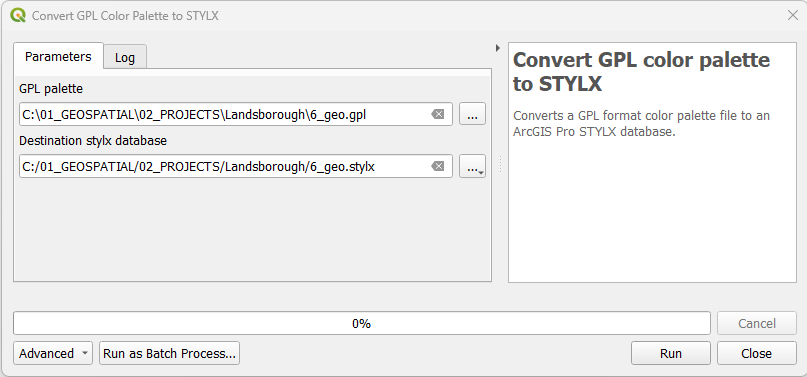

1. In the **QGIS** `Processing Toolbox`, click on `SLYR` ▶️ `ArcGIS Pro`
   ▶️ `Convert GPL color palette to STYLX`.
2. Under the `GPL palette`, browse to the location of the *.gpl* file.
3. Under `Destination stylx database`, set the location of the *.X* file.
4. In **ArcGIS Pro**, in the `Catalog` panel, right mouse click on the *.stylx*
   file and select `Add Style`.
   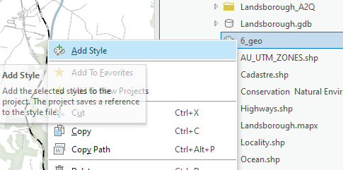
5. In `Geoprocessing`,

> This tool is available only with the SLYR full license.
***

### Convert layer to LYRX

| From           | To             |
|----------------|----------------|
| **QGIS** layer | **ESRI** .lyrx | 

Once you have set up your symbology on your layer, **SLYR** will extract the
symbology out from the layer and convert it to a ArcGIS Pro LYRX file that can
be applied to data in ArcGIS Pro.

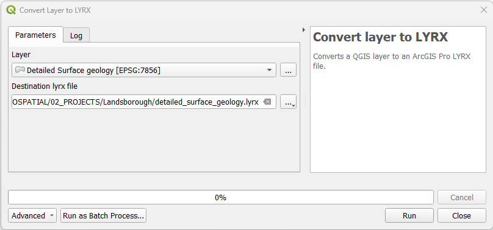

1. In **QGIS**, ensure the layer containing the symbology for exporting is
   loaded.
2. In the `Processing Toolbox`, click on `SLYR` ▶️ `ArcGIS Pro`
   ▶️ `Convert layer to LYRX`.
3. Under `Layer`, select the layer.
4. Under `Destination lyrx file`, set the location of the *.lyrx* file.
5. Click `Run`.
6. Once processed, in **ArcGIS Pro**, navigate via the `Catalog` and open the
   *.lyrx* file.

> This tool is available only with the SLYR full license.
***

### Convert LYRX to QLR

| From           | To            |
|----------------|---------------|
| **ESRI** .lyrx | **QGIS** .qlr | 

Converts an ArcGIS Pro LYRX file to a QGIS QLR file. Both of these files act
similarly and will reach back to the original data file.

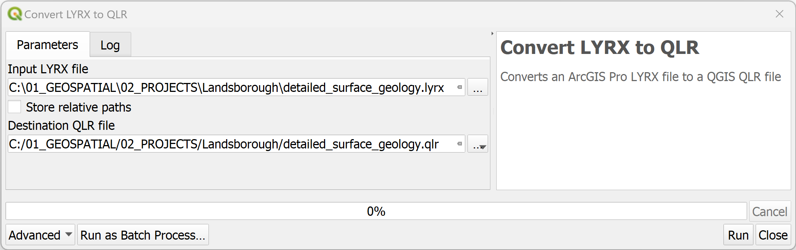

1. In the **QGIS** `Processing Toolbox`, click on `SLYR` ▶️ `ArcGIS Pro`
   ▶️ `Convert LYRX to QLR`.
2. In the `Input LYRX file`, browse to the location of the *.lyrx* file.
3. Choose to store relative paths - this will impact on the performance of the
   QLR if the data is removed from the specified location.
4. Under `Destination QLR file`, set the location of the *.qlr* file.
5. Click `Run`
6. Once processed, you can drag and drop the *.qlr* file from the **QGIS
   ** `Browser` into your map.

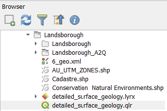

> This tool is available only with the SLYR full license.
***

### Convert LYRX to QML

| From           | To            |
|----------------|---------------|
| **ESRI** .lyrx | **QGIS** .qml | 

Converts an ArcGIS Pro LYRX file to a QGIS QML file. If multiple layers are
present in the LYRX file, each will be converted to an individual QML file.

1. In the **QGIS** `Processing Toolbox`, click on `SLYR` ▶️ `ArcGIS Pro`
   ▶️ `Convert LYRX to QML`.
2. In the `Input LYRX file`, browse to the location of the *.lyrx* file.
3. Under `Destination QML file`, set the location of the *.qml* file.
   > If more than one layer exists in the **lyrx** file, a qml will be produced
   for each
4. Once processed, load the **.qml** files via the `Layer Properties`.

> This tool is available only with the SLYR full license.
***

### Convert MAPX to QGS

| From           | To            |
|----------------|---------------|
| **ESRI** .mapx | **QGIS** .qgs | 

Converts an MAPX document file to a QGS project file.

1. Save your **ArcGIS Pro** file then export your map out as a *.mapx* file.
2. In the **QGIS** `Processing Toolbox`, click on `SLYR` ▶️ `ArcGIS Pro`
   ▶️ `Convert MAPX to QGS`.
3. In the `Input MAPX file`, browse to the location of the *.mapx* file.
4. Under `Destination QGS project file`, set the location of the *.qgs* file to
   the same **ArcGIS Pro** project folder (hint: where the .aprx is stored).
5. Click 'Run'.
6. Open up the *.qgs* file and check through.
   > In some cases, labels do not automatically turn on. Note that labeling
   parameters are saved, it just needs to be manually turned on.
7. Save your project as *.qgz* if required.

> This tool is available only with the SLYR full license.
***

### Convert QGIS style XML to STYLX

| From          | To              |
|---------------|-----------------|
| **QGIS** .xml | **ESRI** .stylx |

Converts a QGIS XML style database to an ArcGIS Pro STYLX database. You will
need to create an XML style file. If this has not already been completed, refer
to [14.1.1.3 Sharing style items](https://docs.qgis.org/3.28/en/docs/user_manual/style_library/style_manager.html)
in **QGIS** documentation. Creating an XML of your styles allows for portability
between software and is handy if you have curated a set of styles unique to a
project.

1. In the **QGIS** `Processing Toolbox`, click on `SLYR` ▶️ `ArcGIS Pro`
   ▶️ `Convert QGIS style XML to STYLX`.
2. In the `Style XML`, browse to the location of the *.xml* file.
3. Under `Destination stylx database`, set the location of the *.stylx* file.
4. Click `OK`.
5. Once processed, in **ArcGIS Pro**, navigate via the `Catalog` and open the
   *.stylx* file.

> This tool is available only with the SLYR full license.
***

### Convert QGIS to MAPX

| From               | To                        |
|--------------------|---------------------------|
| **QGIS** .qgz, qgs | **ESRI ArcGIS Pro** .mapx |

Converts a **QGIS** project to a *.mapx*. A *.mapx* is an ESRI map file format
used in their software **ArcGIS Pro**. This tools allows sharing of
maps, containing all the layers from the QGIS project.

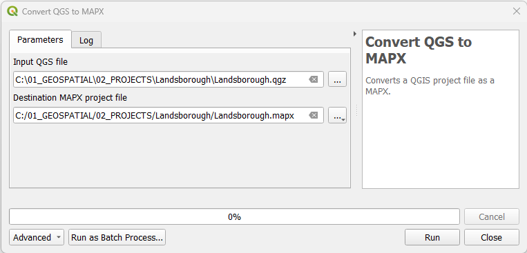

1. In the **QGIS** `Processing Toolbox`, click on `SLYR` ▶️ `ArcGIS Pro`
   ▶️ `Convert QGIS to MAPX`.
2. In the `Input QGIS file`, browse to the location of the *.qgs* or *.qgz*
   file.
3. Under `Destination MAPX project file`, set the location of the *.mapx* file.
4. Click `OK`.
   > If errors are returned, read through the `Log`, rectify the issues and
   rerun the tool.
5. Once processed, in **ArcGIS Pro**, navigate via the `Catalog` and open the
   *.mapx* file.

> Available only with the SLYR full license.
> Can be run as a batch tool
***

### Convert QML to STYLX

| From          | To              |
|---------------|-----------------|
| **QGIS** .qml | **ESRI** .stylx |

Converts a QGIS QML style definition to an ArcGIS Pro STYLX database, containing
all the symbols from the QML style.

1. In the **QGIS** `Processing Toolbox`, click on `SLYR` ▶️ `ArcGIS Pro`
   ▶️ `Convert QML to STYLX`.
2. For the `Input QML file`, browse to the location of the *.qml* file.
3. Under `Destination stylx database`, set the location of the *.stylx* file.
4. Click `OK`.
5. Once processed, in **ArcGIS Pro**, navigate via the `Catalog` and open the
   *.stylx* file.

> This tool is available only with the SLYR full license.

### Convert STYLX to GPL color palette

| From            | To            |
|-----------------|---------------|
| **ESRI** .stylx | **QGIS** .gpl | 

Converts an ArcGIS Pro STYLX database to a GPL format color palette file,
extracting all color entities saved in the style. GPL color palettes are a standard
file format for sharing color schemes, and these palettes can be added to your
QGIS color libraries for easy access.

1. In the **QGIS** `Processing Toolbox`, click on `SLYR` ▶️ `ArcGIS Pro`
   ▶️ `Convert STYLX to GPL color palette`.
2. For `Stylx database`, browse to the location of the *.stylx* file.
3. Under `Destination GPL file`, set the location of the *.gpl* file.
4. Click on `Run`.
5. Once converted, import via `Settings` ▶️ `Options`▶️ `Color` and ensure you
   tick `Show in Color Buttons`to access it via the color drop-down function
   in `Layer Styling`.

In this example, I have added a Landuse - Natural Environment GPL palette.

> This tool is available only with the SLYR full license.
***

### Convert STYLX to QGIS style XML

| From            | To            |
|-----------------|---------------|
| **ESRI** .stylx | **QGIS** .xml | 

Converts an ArcGIS Pro STYLX database to a QGIS XML Style library. This is
particularly useful if your project has a selection of unique symbols that you
wish to continue to use.

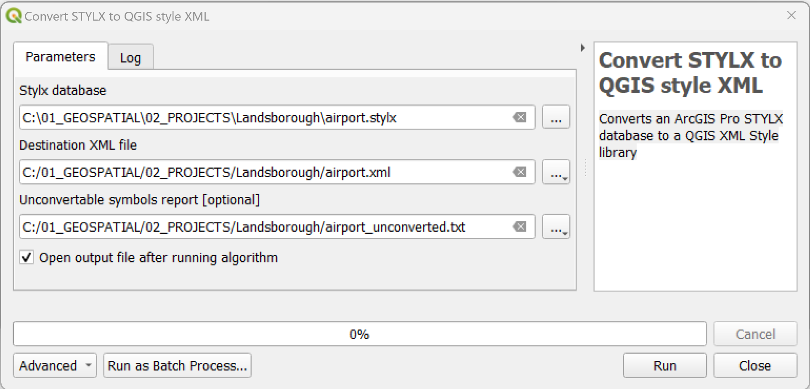

1. In the **QGIS** `Processing Toolbox`, click on `SLYR` ▶️ `ArcGIS Pro`
   ▶️ `Convert STYLX to QGIS style XML`.
2. Under `Stylx database`, browse to the location of the *.stylx* file.
3. Under `Destination XML file`, set the location of the *.xml* file.
4. Optionally, in 'Unconvertable symbols report' enter a location for those
   symbols that fail to convert. This allows you to create a new vector layer
   containing details of all unconvertable symbols. This report can be saved as
   any standard vector format, including CSV, XLSX or Geopackage.
5. Under the `Advanced` group you can find options for filtering the symbols
   from the STYLX database to convert. You can filter by object type or by
   entering a wildcard text string to match against the symbol names. The
   wildcard filter can include the `*` character or `?` character to match
   against multiple characters or a single character, eg `*wall*` will match
   any symbol with wall in the symbol name.
6. Click on `Run`.
7. Once it has converted, you can import the *XML* file via the `Style Manager` ▶️ `Import/Export`.

> This tool is available only with the SLYR full license.
***

### Import PAGX print layout

| From           | To                  |
|----------------|---------------------|
| **ESRI** .pagx | **QGIS** .qgs, .qgz | 

Imports a PAGX print layout into the current QGIS project.

1. In ArcGIS Pro, make sure you save your layout first, then *share* as a '
   Layout file'
2. In the **QGIS** `Processing Toolbox`, click on `SLYR` ▶️ `ArcGIS Pro`
   ▶️ `Imports a PAGX Print Layout`.
3. In the `Input PAGX file`, browse to the location of the *.pagx* file.
4. Click 'Run'
5. Open up the imported print layout from `Project` ▶️`Layouts`

> This tool is available only with the SLYR full license.
***

## AVL styles

### Convert AVL to QML

| From          | To            |
|---------------|---------------|
| **ESRI** .avl | **QGIS** .qml | 

Converts an ESRI ArcInfo AVL file to a QGIS QML file. AVL files were the legend
files for ArcView 3.x but have been replaced by layer files. It is no longer
possible to create AVL legend files in the last version of ArcMap.

1. In the **QGIS** `Processing Toolbox`, click on `SLYR` ▶️ `AVL styles`
   ▶️ `Convert AVL to QM`.
2. In the `Input AVL file`, browse to the location of the *.avl* file.
3. Under `Destination QML file`, set the location of the *.qml* file.
4. Click `Run`.

Conversion of Land cover of Sierra Leone - Globcover Regional (46 classes) (
source: [FAO](https://data.apps.fao.org/catalog/iso/973fdcbe-c347-47a7-9af7-e2e57729a35b))

> This tool is available only with the SLYR full license.
***

## Data Conversion

**QGIS** [has the capability of creating, reading and managing GeoDatabases](https://north-road.com/2022/11/24/qgis-3-28-improvements-for-working-with-esri-formats-and-services/),
therefore conversion is not necessary to keep on working with your data in
**QGIS**. Understanding why you want to convert from a geodatabase to a
geopackage is important.

- If you are still going to work alongside **ESRI** software, then the
  recommendation here is ***not*** to convert it.
- If you are moving completely to **QGIS**, and just love the extra
  functionality that GeoPackages give you, then continue on with the data
  conversion.

### Convert File Geodatabase to GeoPackage

| From          | To            |
|---------------|---------------|
| **ESRI** .gdb | **OGC** .gpkg | 

Converts all data from an ESRI File Geodatabase to a GeoPackage database.

This tool will convert:

- All vector layers
- Field domains

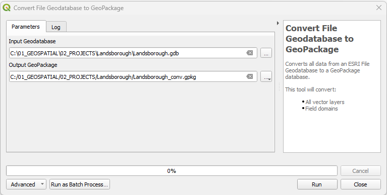

1. In the **QGIS** `Processing Toolbox`, click on `SLYR` ▶️ `Data Conversion`
   ▶️ `Convert File Geodatabase to GeoPackage`.
2. In the `Input GeoDatabase`, browse to the location of the *.gdb* file.
3. Under `Output GeoPackage`, set the location of the *.gpkg* file.
4. Click `Run`.

> This tool is available only with the SLYR full license.

### Convert project data to GPKG

| From                   | To            |
|------------------------|---------------|
| **QGIS** loaded layers | **OGC** .gpkg | 

Converts all referenced data from the current project to standard formats.

Referenced layer data stored in non-standard formats (such as MDB or GDB files)
will be converted to the standard GeoPackage format
in order to create projects and data files which are optimized for use in QGIS
and other open-source tools.

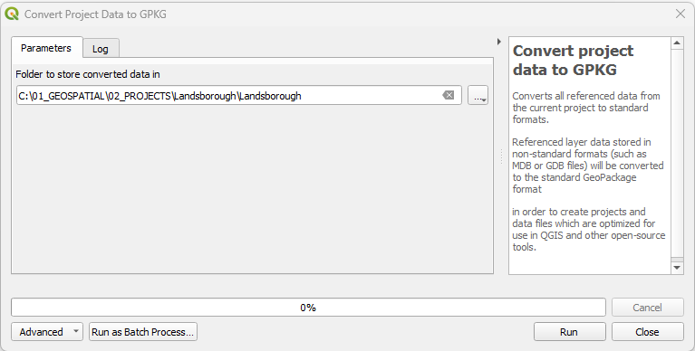

1. In the **QGIS** `Processing Toolbox`, click on `SLYR` ▶️ `Data Conversion`
   ▶️ `Convert project data to GPKG`.
2. In `Folder to store converted data in`, browse to the location of the folder
   you wish to store the geopackage in.
3. Click `Run`.

> This tool is available only with the SLYR full license.
***

--- tool currently not working

## Hyperlinks

### Extract hyperlinks to tables

| From                         | To            |
|------------------------------|---------------|
| **ESRI** .mxd/.mxt/.pmf/.lyr | **OGC** .gpkg | 

Extract hyperlinks from layers to standalone tables

1. In the **QGIS** `Processing Toolbox`, click on `SLYR` ▶️ `Hyperlinks`
   ▶️ `Extract hyperlinks to tables`.
2. In the `Input .MXD/.MXT/.PMF/.LYR`, browse to the location of the file.
3. Under `Destination Geopackage`, set the location of the *.gpkg* file.
4. Click `Run`.

> This tool is available only with the SLYR full license.
***

## LYR Datasets

### Convert LYR to QGIS style XML

| From          | To            |
|---------------|---------------|
| **ESRI** .lyr | **QGIS** .xml | 

Converts an ESRI LYR file to a QGIS style XML file that can be additionally be
used in other applications. For QGIS, you can use the XML to load into the
style manager, which is handy to port over standardized symbology used in
workflows.

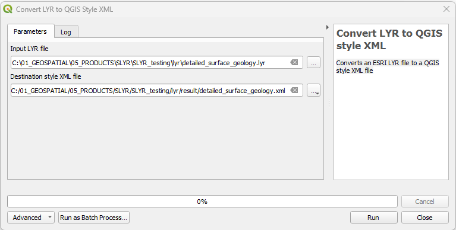

1. In the **QGIS** `Processing Toolbox`, click on `SLYR` ▶️ `LYR Datasets`
   ▶️ `Convert LYR to QGIS style XML`.
2. In the `Input LYR file`, browse to the location of the *.lyr* file.
3. Under `Destination style XML file`, set the location of the *.xml* file.
4. Click `Run`.

> This tool is available in the Community Edition and with the SLYR full
> license.

### Convert LYR to QLR

| From          | To            |
|---------------|---------------|
| **ESRI** .lyr | **QGIS** .qlr | 

Converts an ESRI LYR file to a QGIS QLR file.

1. In the **QGIS** `Processing Toolbox`, click on `SLYR` ▶️ `LYR Datasets`
   ▶️ `Convert LYR to QLR`.
2. In the `Input LYR file`, browse to the location of the *.lyr* file.
3. Under `Destination QLR file`, set the location of the *.qlr* file.
4. Click `Run`.

> This tool is available in the Community Edition and with the SLYR full
> license.

### Convert LYR to QML

| From          | To            |
|---------------|---------------|
| **ESRI** .lyr | **QGIS** .qml | 

Converts an ESRI LYR file to a QGIS QML file. If multiple layers are present in
the LYR file, each will be converted to an individual QML file.

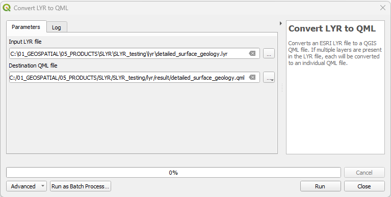

1. In the **QGIS** `Processing Toolbox`, click on `SLYR` ▶️ `LYR Datasets`
   ▶️ `Convert LYR to QML`.
2. In the `Input LYR file`, browse to the location of the *.lyr* file.
3. Under `Destination QML file`, set the location of the *.qml* file.
4. Click `Run`.

> This tool is available in the Community Edition and with the SLYR full
> license.

### Set style from LYR file

| From          | To                       |
|---------------|--------------------------|
| **ESRI** .lyr | **QGIS** layer symbology | 

Sets a layer's settings and symbology from an ESRI LYR file.

1. In the **QGIS** `Processing Toolbox`, click on `SLYR` ▶️ `LYR Datasets`
   ▶️ `Set style from LYR file`.
2. In the `Destination layer`, select the layer from the dropdown list.
3. Under `LYR file`, set the location of the *.lyr* file.
4. Click `Run`.

Note that the **ArcMap** symbology has a transparency setting to 50% and that
this is not carried over in the LYR settings.

> This tool is available in the Community Edition and with the SLYR full
> license.

***

## MXD documents

### Add layers from MXD to project

| From          | To                  |
|---------------|---------------------|
| **ESRI** .mxd | **QGIS** .qgs, .qgz | 

This tool will add layers from an MXD document to the current project, with
each layer's original symbology, including labels and placement. It won't be
automatically saved, so remember to save it once it comes in. The layers will
source the data from the original location. This tool could be used to bring in
multiple mxds into a single project using the Batch Process tool.

1. In the **QGIS** `Processing Toolbox`, click on `SLYR` ▶️ `MXD documents`
   ▶️ `Add layers from MXD to projec`.
2. In the `Input MXD file`, browse to the location of the *.mxd* file.
3. Click `Run`.
4. Save the project to a desired location.

> This tool is available only with the SLYR full license.

### Convert MXD/MXT to QGS

| From          | To                  |
|---------------|---------------------|
| **ESRI** .mxd | **QGIS** .qgs, .qgz | 

This tool converts an MXD or MXT document file to a QGIS project file. If you
wish to save the project to qgz, open the project and click `save as`

1. In the **QGIS** `Processing Toolbox`, click on `SLYR` ▶️ `MXD documents`
   ▶️ `Convert MXD/MXT to QGS`.
2. In the `Input MXD/MXT file`, browse to the location of the *.mxd* file.
3. Under `Destination QGS project file`, set the location of the *.qgs* file.
4. Click `Run`.
5. Navigate to the location of the newly created MXD and open it.

> This tool is available only with the SLYR full license.

### Convert MXD/MXT to QGS and data to GPKG

| From          | To                   |
|---------------|----------------------|
| **ESRI** .mxd | **QGIS** .qgs, .gpkg | 

This tool converts an MXD or MXT document file to a QGIS project file, and
converts all referenced data to standard formats.
Referenced layer data stored in non-standard formats (such as MDB or GDB files)
will be converted to the standard GeoPackage format in order to create projects
which are optimized for use in QGIS and other open-source tools.

1. In the **QGIS** `Processing Toolbox`, click on `SLYR` ▶️ `MXD documents`
   ▶️ `Convert MXD/MXT to QGS and data to GPKG`.
2. In the `Input MXD/MXT file`, browse to the location of the file.
3. Under `Destination QGS project file`, set the location of the *.qgs* file.
4. Under `Folder to store converted data in` enter the location for the
   data.
5. Click `Run`.

> This tool is available only with the SLYR full license.

### Export document structure

| From          | To    |
|---------------|-------|
| **ESRI** .mxd | .json | 

This algorithm exports a JSON representation of the internal structure of an
ESRI MXD or LYR document file. It is designed for debugging purposes, allowing
users to view in-depth detail about the document structure and layer
configuration.

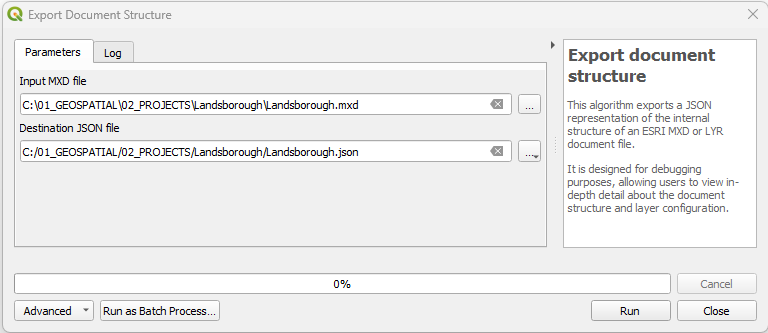

1. In the **QGIS** `Processing Toolbox`, click on `SLYR` ▶️ `MXD documents`
   ▶️ `Export document structure`.
2. In the `Input MXD file`, browse to the location of the *.mxd* file.
3. Under `Destination JSON file`, set the location of the *.json* file.
4. Click `Run`.
5. Open up the JSON file to inspect the structure.

> This tool is available only with the SLYR full license.
***

## PMF published maps

### Convert PMF to QGS

| From          | To            |
|---------------|---------------|
| **ESRI** .pmf | **QGIS** .qgs | 

Description

1. In the **QGIS** `Processing Toolbox`, click on `SLYR`
   ▶️ `PMF published maps` ▶️ `Convert PMF to QGS`.
2. In the `Input PMF file`, browse to the location of the *.pmf* file.
3. Under `Destination QGS project file`, set the location of the *.qgs* file.
4. Click `Run`.

> This tool is available only with the SLYR full license.
***

## SDE documents

### Extract SDE connection details

| From          | To    |
|---------------|-------|
| **ESRI** .sde | .json | 

This algorithm extracts the connection details from a .sde connection file.
Optionally, a JSON representation containing these details can be exported.

1. In the **QGIS** `Processing Toolbox`, click on `SLYR` ▶️ `SDE documents`
   ▶️ `Extract SDE connection details`.
2. In the `Input SDE file`, browse to the location of the *.sde* file.
3. Under `Destination JSON file [optional]`, set the location of the *.json*
   file.
4. Click `Run`.

> This tool is available only with the SLYR full license.
***

## SLD

### Convert LYR to SLD

| From          | To           |
|---------------|--------------|
| **ESRI** .lyr | **OGC** .sld |

Converts an ESRI LYR file to a OGC SLD file. If multiple layers are present in
the LYR file, each will be converted to an individual OGC SLD file.

1. In the **QGIS** `Processing Toolbox`, click on `SLYR` ▶️ `SLD`
   ▶️ `Convert LYR to SLD`.
2. In the `Input LYR file`, browse to the location of the *.lyr* file.
3. Under `Destination SLD file`, set the location of the *.sld* file.
4. Click `Run`.

> This tool is available only with the SLYR full license.

### Convert LYRX to SLD

| From           | To           |
|----------------|--------------|
| **ESRI** .lyrx | **OGC** .sld |

Converts an **ArcGIS Pro** LYRX file to a **OGC** SLD file.  
*N.B. If you have merged values in ArcGIS Pro, these will return as `ELSE`in
QGIS. So reassess those categories that are merged or once you are in QGIS,
create the rules based on these values*

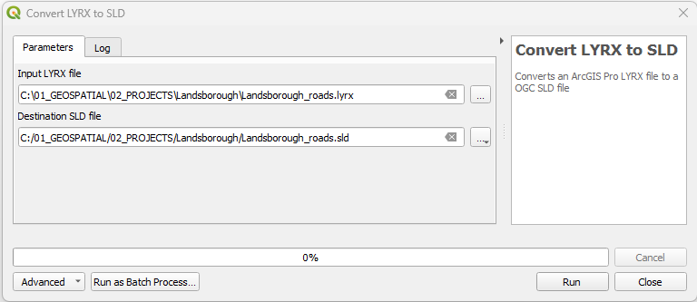

1. In the **QGIS** `Processing Toolbox`, click on `SLYR` ▶️ `SLD`
   ▶️ `Convert LYRX to SLD`.
2. In the `Input LYRX file`, browse to the location of the *.lyrx* file.
3. Under `Destination SLD file`, set the location of the *.sld* file.
4. Click `Run`.

> This tool is available only with the SLYR full license.
***

## Style databases

### Convert ESRI style to GPL color palette

| From                    | To                  |
|-------------------------|---------------------|
| **ESRI** style database | **QGIS** .qgs, .qgz | 

This is a great tool if you use a standard palette for your cartography. It
converts **ESRI Arcmap** style database to a GPL format color palette file,
extracting all color entities saved in the style. GPL files can be used in *
*Inkscape** and **GIMP** but for **QGIS**, you can load them via `Settings`
▶️ `Options` ▶️ `Colors`.

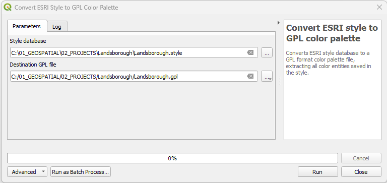

1. In the **QGIS** `Processing Toolbox`, click on `SLYR` ▶️ `Style databases`
   ▶️ `X`.
2. In the `Input X`, browse to the location of the *.X* file.
3. Under `Destination X`, set the location of the *.X* file.
4. Click `Run`.

> This tool is available only with the SLYR full license.

### Convert ESRI style to QGIS style XML

| From                    | To            |
|-------------------------|---------------|
| **ESRI** style database | **QGIS** .xml | 

For importing a large amount of symbology from your styles, this tool converts
**ESRI** style database to a **QGIS** XML Style library, that can then be
imported into your **QGIS** Style Manager

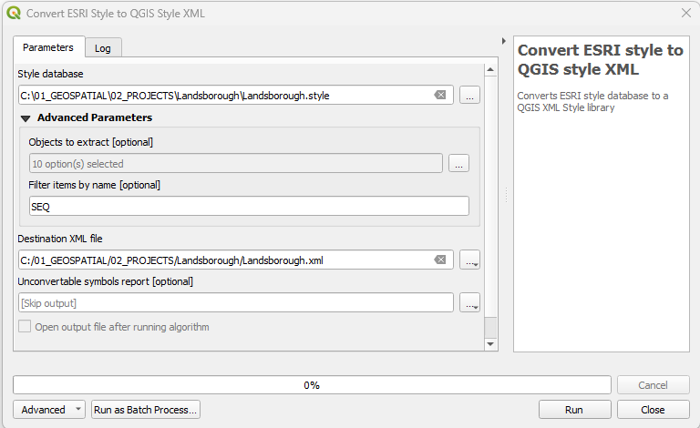

1. In the **QGIS** `Processing Toolbox`, click on `SLYR` ▶️ `Style databases`
   ▶️ `Convert ESRI style to QGIS style XML`.
2. In the `Style database`, browse to the location of the *style* file.
3. Under `Advanced Parameters`:
    - Choose what objects to extract (this is optional).
      
    - Enter a name to filter the items, this is handy if you wish to extract on
      a certain group from the style.
4. Under `Destination XML file`, set the location of the *.xml* file.
5. If you wish to capture those symbols that don't convert, enter a
   location. Choose whether to open that output automatically after it has run.
6. Click `Run`.

> This tool is available only with the SLYR full license.
***

## SXD documents

### Tool

| From                   | To            |
|------------------------|---------------|
| **ESRI ArcScene** .sxd | **QGIS** .qgs | 

Converts an ArcScene SXD document file to a 2D QGIS project file.

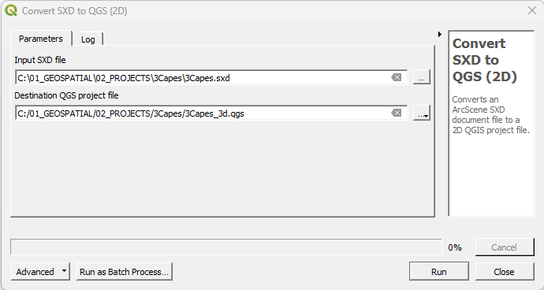

1. In the **QGIS** `Processing Toolbox`, click on `SLYR` ▶️ `SXD documents`
   ▶️ `Convert SXD to QGS (2D)`.
2. In the `Input SXD file`, browse to the location of the *.sxd* file.
3. Under `Destination QGS project file`, set the location of the *.qgs* file.
4. Click `Run`.

> This tool is available only with the SLYR full license.
***
