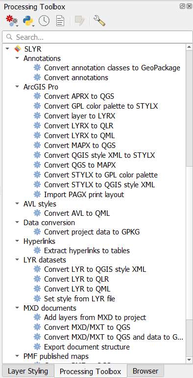
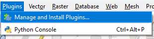
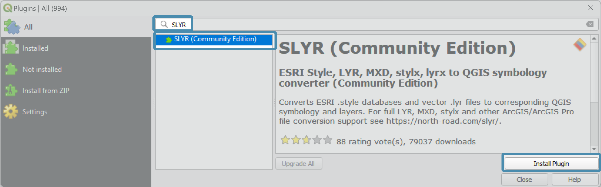
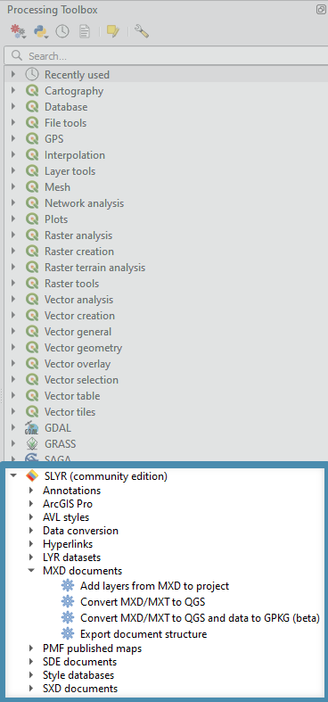

# Get Started
SLYR is available in two versions:
  
Version | Cost | Details
:-------: | :-----: |:------ 
SLYR  | €1200 | Contact [North Road](https://north-road.com/contact/)
SLYR (Community Edition) | Free | Access via QGIS Plugin Manager 

<!--I want to remove the shading in the second row-->

Once purchased, SLYR is like the ever-lasting gobstopper! Users will get the latest tools via version updates at no extra cost. So no annual maintenance and you can update at your leisure using the QGIS **Plugin Manager**. 

## Install **SLYR** ##
After purchasing **SLYR**, **North Road** will send you your licence details and instructions on how to install it.

Once installed, **SLYR** will appear in the browser panel. Expand the tools and start using them.

## Install the **SLYR (Community Edition)** ##
To install the **SLYR (Community Edition)**, open the **Plugin Manager**, click on the top menu item `Plugins` ▶️ `Manage and Install Plugins`.

In the dialog that opens, type *SLYR* in the search bar. 

In the middle panel, click on the *SLYR (Community Edition)*  and then click on `Install Plugin`

The Plugin Manager will then run the Install for you. When the install has completed, click on `Close`.

>Any further updates to the SLYR plugin will be available to you within the Plugin Manager. 

The **SLYR (Community Edition)** will appear in the browser panel. Expand the tools and start using them.

>The **SLYR (Community Edition)** has limited tools - check the [SLYR Blog](https://north-road.com/slyr/) for availability as we update tool accessibility once we have reached our funding goals.
>A tool will return an error if is is only available in the fullly licenced **SLYR**.
 
 
