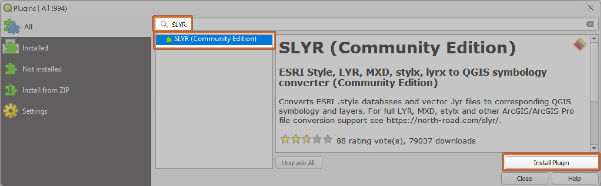

# Get Started
SLYR is available in two versions:
  
Version | Cost | Details
:-------: | :-----: |:------ 
SLYR (Community Edition) | Free | Access via QGIS Plugin Manager 
SLYR  | €1200 | Contact North Road 

[comment]: <> (I want to remove the shading in the second row)

To open the Plugin Manager, click on the top menu item `Plugins` :arrow_right: `Manage and Install Plugins`.

In the dialog that opens, type *SLYR* in the search bar, click on the *SLYR (Community Edition)* in the middle panel and click on `Install Plugin`

