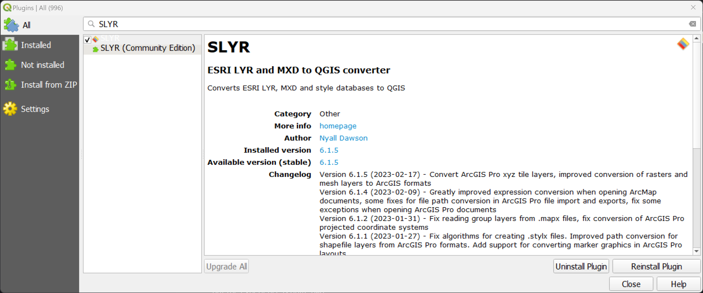

<!-- use pronouns-->
# Frequently Asked Questions #
Have a question? Check the entries below for an answer. 
>If the answer to your question is not here, please email us at [North Road Support](mailto:info@north-road.com)

## Cost of SLYR Plugin ##
At the time of writing, to purchase the SLYR Plugin costs €1200. For those located outside of Europe, the cost will be as per the conversion rate at the time of issuing the invoice. 

## File Formats 
SLYR uses many file formats, you will know what you are doing, but just in case you have drawn a blank, here is  alist of those you may encounter.
|      **Format**    |           **Source**                                                                                        |   **Software Project**     |
| ------------------ | ----------------------------------------------------------------------------------------------------------- | ---------------- |
| Layer              | QGIS speak for a data layer                                                                                 | QGIS             |
| QGIS style XML     | QGIS style file                                                                                             | QGIS             |
| QGS                | QGIS map file                                                                                               | QGIS             |
| QLR                | QGIS Layer Definition File - export many file styles in a group                                             | QGIS             |
| QMD                | QGIS metadata fle                                                                                           | QGIS             |
| QML                | QGIS style file                                                                                             | QGIS             |
| GPKG               | Various                                                                                                     | OGC              |
| SLD                | Styled layer descriptor: XML descriptor, OGC standard                                                       | OGC              |
| WMS                | Web Mapping Service                                                                                         | OGC              |
| CSS                | Cascading style sheet                                                                                       | HTML             |
| GPL color palette  | GIMP                                                                                                        | GIMP/QGIS        |
| Annotation classes | ESRI file that contains properties that determine how a subset of annotation in the feature class displays. | ESRI             |
| APTX               | ArcGIS Pro Project template                                                                                 | ESRI             |
| AVL                | Arcview style                                                                                               | ESRI             |
| ESRI APTX          | ESRI labelling file that may be text or a graphic. It enables placement control by the user                 | ESRI             |
| LXRX               | ArcGIS Pro                                                                                                  | ESRI             |
| LYR                | ArcMap style                                                                                                | ESRI             |
| MAPX               | ArcGIS Pro map file                                                                                         | ESRI             |
| MDB                | Personal geodatabase                                                                                        | ESRI             |
| MXD                | Arcgis Map file                                                                                             | ESRI             |
| MXT                | ArcGIS Map template                                                                                         | ESRI             |
| PAGX               | ArcGIS Pro Layout file                                                                                      | ESRI             |
| PMF                | ArcMap ESRI Published map for ArcReader                                                                     | ESRI             |
| PPRX               | ArcGIS Pro aprx zipped file                                                                                 | ESRI             |
| Representations    | ArcMap symbol information stored inside feature classes                                                     | ESRI             |
| SDE                | ArcSDE connection file                                                                                      | ESRI             |
| STYLE              | An ArcGIS style is really a Microsoft Access database.                                                      | ESRI             |
| STYLX              | ArcGIS Pro                                                                                                  | ESRI             |
| SXD                | ArcScene                                                                                                    | ESRI             |
| VTPK               | Vector tile package                                                                                         | ESRI             |

## How many users will a licence cover ##
A single **SLYR** licence agreement covers use by 20 users in the same physical location i.e. an office address. It will also cover remote users that are attached to the defined physical location. If you have multiple locations, or over 20 users that require use of the licence, please let [us](mailto:info@north-road.com) know and we will assess each case on an individual basis. 

## How to run the tool outside of QGIS ##
While it's possible to call the **Python** modules directly from standalone scripts, this is not recommend and is not officially supported by **North Road**. However, the official endorsed way of running the tools outside of **QGIS** is to use `qgis_process`.

## Purchase process ##
If you would like to to purchase SLYR send us an email. As we often deal with clients in Europe and America, there is often a lag due to the time differences as we are located in Queensland, Australia (AEST, GMT+10). 

To speed up the process, include the details below in your email so we can produce an invoice for you straight away. If you need a quote first, let us know in the email and provide the same details listed below.

To create an invoice or quote, we require the following information:

> Organisation name/Your name
> 
> Office address
> 
> VAT number (if in Europe)
> 
> Purchase order number (if required)
> 
> Expected number of users
> 
> Type of users (in office/remote)

When we receive payment (credit card, bank transfer or PayPal), we will send you the licence and instructions for using **SLYR**.

## Remote Users ##
We work remotely too, so we know how you need to have access to all of your tools. If you are attached to an office location, but work remotely, you are covered under our license agreement. 

## Student versions ##
Unfortunately we do not offer a student version of **SLYR**. We recommend you approach your institution to purchase **SLYR**. 

## Support ##
North Road offers a high level of support to all **SLYR** purchases. You can contact us at anytime via [email](mailto:info@north-road.com). 
> - If there is a bug we will fix it to the best of our abilities and release it as soon as we can. 
>
> - If you wish a tool to work in a certain way i.e. develop a new feature, and if there are no barriers to developing it (software constraints in QGIS/ESRI), we will attempt to do it. 
>
> - If it is something that will require a high level of development, you can consider whether to join the current **Hall of Fame** and sponsor its development.

## Trial versions ##
Evaluation versions of the tool are not available. If you require a sample to evaluate prior to purchasing, email QGIS or ESRI files to [North Road Support](mailto:info@north-road.com) and we will convert it at no cost.

For each conversion, send through these files

| Source | File type to send |
| ------ | :----------------- |
| ESRI | .aprx, .mapx, .mxd |
| QGIS | .qgs .qgz |

## Version updates  ##
SLYR is updated many times during the year, at least once per quarter. To find out what has been updated in the latest version, check out the changelog in the `QGIS Plugin Manager`. Checkout [Troubleshooting](/user_guide/troubleshooting) on how to update your **SLYR** version. 

## What licences do I need? ##
SLYR is designed so that you can push out ESRI products without the need of an ESRI licence as you undetake all **SLYR** operations in **QGIS**. You only need to have [QGIS](https://www.qgis.org/en/site/) installed. However, if you wish to view the output in an ESRI environment, you will need an appropriate type of licence for the file type. For more information on files types and the software needed, check out [Fileformat's GIS list](https://docs.fileformat.com/gis/).

## What QGIS version do I need? ##
The latest QGIS version is always the best as we update SLYR to meet the latest versions. However, SLYR will work with older versions - we recommend using versions from v3.16 onwards.
