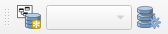

## Installation

1. [Install QGIS 3](https://qgis.org/en/site/forusers/download.html)

2. Use the plugin manager to install the "QGIS Model Baker" plugin.

## The Model Baker Functionalities

After the installation you can find all the Features in the *Database > Model Baker* menu.

### Import / Export Wizard
The wizard contains all the functionalities to create database schemas from INTERLIS models, import / export transferdata and generate QGIS projects from the database. It leads you through the process with all the possiblities you have with the single dialogs. Find a guide through the [import and generate process with the wizard](../import_workflow/) and through the [export process with the wizard](../export_workflow/) in this documentation.

### Data Validator
The Data Validator provides you the possiblity to check the data currently open in your QGIS against an INTERLIS model. You can open the validator panel as well over *View > Panels > Model Baker Data Validator*. See for more information about it [Validate Data](../user_guide/validation.md)

### Dataset Manager
The dataset manager provides you the possiblity to create and rename datasets and generate the baskets for the datasets. More information you can find in the [Dataset and Basket Handling](../background_info/basket_handling.md)

## The Model Baker Toolbar
Most of the functionalities are available in the toolbar as well.

The dropdown box there is used to work with the datasets during digitizing / editing data. See for more information the [Dataset and Basket Handling](../background_info/basket_handling.md)
