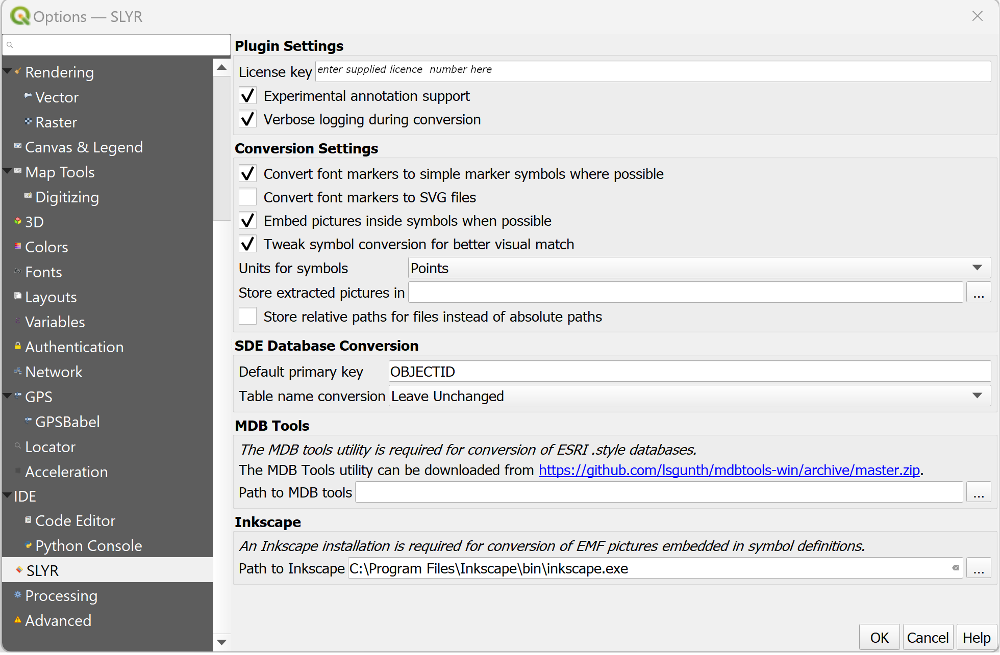

# Set-up SLYR #
<!-- it would be nice to only give access to this page to purchasers -->

## Install the plugin ##
Once purchased, users will receive an email from North Road with a link for the installer and their licence key. 

1. Download the installer from the link. 
> Place the zip file in a safe location for future reference - just in case you need to update your machine so you can reload it. 

2. Unzip the downloaded file, and then drag the extracted "install_slyr_qgis.py" over an open QGIS window. (If prompted, accept the warning regarding trusted scripts). The script will add a connection to the private plugins repository, and install the SLYR plugin for you.

3. After the plugin is installed, the SLYR options dialog will open. Enter your unique license key at this screen, exactly as it appears at the end of this email. Enter the optional requirements outlined in the *SLYR Options* section below.

## SLYR Options ##
The SLYR Options dialog provides users the ability to set-up the SLYR Plugin to meet their requirements. 

To access the SLYR Options, in **QGIS** click on the top menu `Settings` ▶️ `Options`.

The `Options` dialog opens, scroll down on the left and click on `SLYR` to access the **SLYR** options.

### Plugin Settings ###
| Setting | Description | Directions |
| ---| --- | --- |
License key | The license key is supplied to users once they have purhcased **SLYR**. | Enter your unique license key at this screen, exactly as it appears at the end of this email.
Experimental annotation support | Annotation support is currently in Beta testing. If you would like to partake in the testing, tick this option. Any issues, please send us an [email](mailto:info@north-road.com?subject=SLYR Annotation) | 
Verbose logging during conversion |  | 

### Conversion Settings ###
| Setting | Description | Directions |
| ---| --- | --- |
Convert font markers to simple marker symbols where possible |  | 
Convert font markerts to SVG files |  | 
Embed pictures inside symbols when possible |  | 
Tweak symbol conversion for better visual match |  |  |  | 
Units for symbols: points, millimeters |  | 
Store extracted picutres in |  | 
Store relative paths for files instead of absolute paths |  | 

### SDE Database Conversion ###
| Setting | Description | Directions |
| ---| --- | --- |
Default primary key | Default value is OBJECTID, but this can be changed as per requirements |
Table name conversion | Options: Leave unchanged, Convert to Uppercase, OR Convert to Lowercase |

### MDB Tools ###

| Setting | Description | Directions |
| ---| --- | --- |
Path to MDB Tools | This is automatically set for the full license, *only the Community License needs to download this tool*. The MDB tools is required for conversion of ESRI .style databases. Click the link in the SLYR Options dialog and once downloaded, enter in the path|

### Inkscape ###
| Setting | Description | Directions |
| ---| --- | --- |
Path to Inkscape | Install Inkscape from [here.](https://inkscape.org) |
