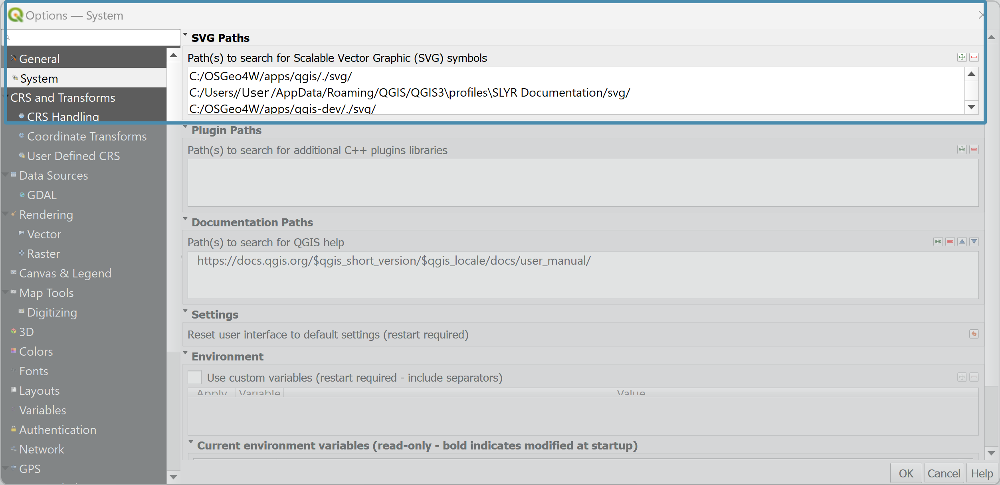
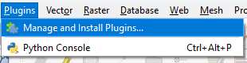

# Troubleshooting #

## Error Messages ##
 Error Message | Rectification |
 ------------- | ------------- |
 Converting .gpkg layers is not yet fully supported, layer path has been replaced with a dummy shapefile path | Convert your geopackages into a GDB or a SHP
 Converting QgsSingleBandColorDataRenderer is not yet supported | This may occur with web-sourced data such as WMS or ArcGIS REST Servers. Remove these datasets from your project or ignore the warning. Once in ArcGIS Pro, add in the data from the source.
 Group transparency was converted to individual layer transparency (group transparency requires QGIS 3.24 or later) | Update your QGIS to QGIS 3.24 or later |
 QgsSvgMarkerSymbolLayer symbol layers cannot be converted yet | Amend layers that contain a QGIS SVG Marker as they will not be converted.  
 Raster layers in Geodatabase files are not supported in QGIS, the database X:\folder\geodatabase.gdb\raster.gdb will need to be converted to TIFF before it can be used outside of ArcGIS | Convert all rasters sitting within the GDB as TIFFs
 Raster catalog layer “RasterLayer” has been removed from the project (raster catalog layers are not supported by QGIS)| These layers will need to be created seperately outside of the catalog layer before conversions.
 
## Geopackage ##
ArcGIS Pro and Geopackages has not yet reached full support. Therefore an error will be produced if you are exporting from a geopackage 
e.g. *Warning: Feature: Converting .gpkg layers is not yet fully supported, layer path has been replaced with a dummy shapefile path*

>  If your files are in a geopackage, ArcGIS Pro will not recognise this and the following may happen:
  >  - The file links will be broken
  >  - If you repath them to the geopackage, this will impact on the symbology. 
>
> Workaround: Export to geodatabase or shapefile

### Export to Geodatabase ###
You can export geopackage data to a new geodatabase or to an existing geodatabase (go from step 3 below).

1. In the QGIS Browser window, right-mouse click the folder you wish to create the geodatabase in and click on `New` ▶️ `ESRI FileGeodatabase`.
2. Type in the name of the geodatabase
3. In the geopackage, select the layers you wish to add to the geodatabase.
4. Drag and drop the selected layers onto the new geodatabase.
5. Repath your data to the shapefiles (right-mouse cick the layer and click on `Change Data Source`.

### Export to shapefile ###
If you have many shapefiles, install the **Bulk Vector Export** plugin.

1. Ensure all the files you wish to export are active (tick them on).
2. Select the output format 'ESRI shapefile`.
3. Select the CRS you wish to export them with.
4. Click on OK.
5. Repath your data to the shapefiles.

## Reinstall my SLYR Plugin ##
If you have changed machines, you may need to reinstall the **SLYR** Plugin. 

1. Navigate to the SLYR Plugin folder you were sent. 

2. Grab the .py and drag and drop it over your QGIS. 

3. Open the `QGIS Plugin Manager`

## SVG ##
### Add in SVG files for QGIS ###
If you have access to the SVG files you need, and you find that SLYR is not bringing them in, check to see if the location is listed in the `Settings` ▶️ `Options` ▶️  `SVG Paths`. 

### Add in SVG files for ArcGIS Pro ###
QGIS SVG Markers are not yet supported for conversion into ArcGIS Pro. They are however on the list to be supported. 
> Workaround: 
> 
> - Remove any svg layers in your layer's symbology. In ArcGIS Pro choose the appropriate style. 
> 
> - If the SVG are unique and required, import them to a style using the [ImportSVGsToStyle](https://carto.maps.arcgis.com/home/item.html?id=c25ab2da6ae343af9acc632120c7cf01){:target="_blank" rel="noopener"}_ ArcGIS Pro Add-In by DStephen_carto.

## Update my SLYR licence ##
**SLYR** is updated regularly and **QGIS** will let you know when a new version has been released. To update your version:

1. Open the **Plugin Manager**, click on the top menu item `Plugins` ▶️ `Manage and Install Plugins`.

2. In the left panel, click on `Upgradeable` 

3. In the central panel, click on `SLYR`. If `SLYR` is not in the middle panel, then you should be up-to-date. 
> Check-out what has been updated in the *Changelog*.

3. On the lower right, click on `Upgrade Plugin`. Once upgraded, click on `Close`.

> If you receive an error after the Plugin update indicating it wasn't able to upgrade, restart QGIS. If it still hasn't been upgrade, send us an email. 

